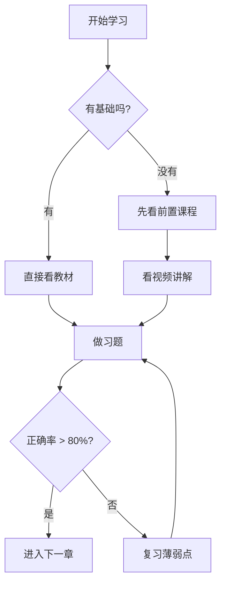
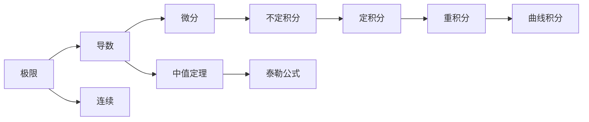
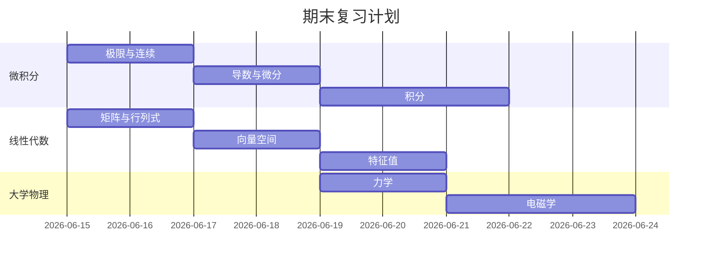
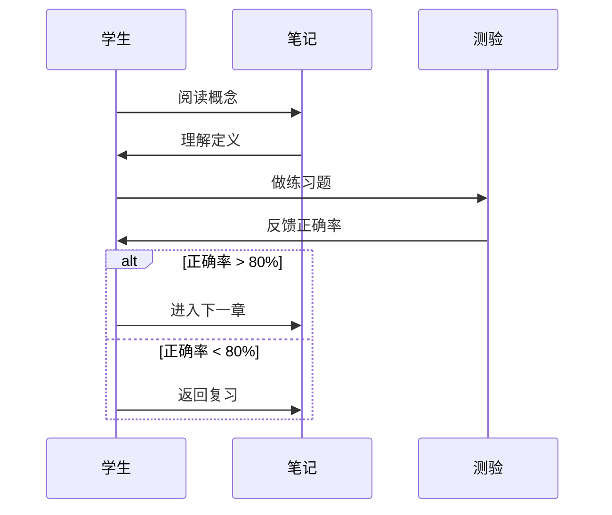
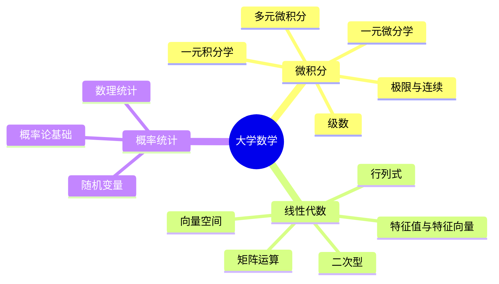
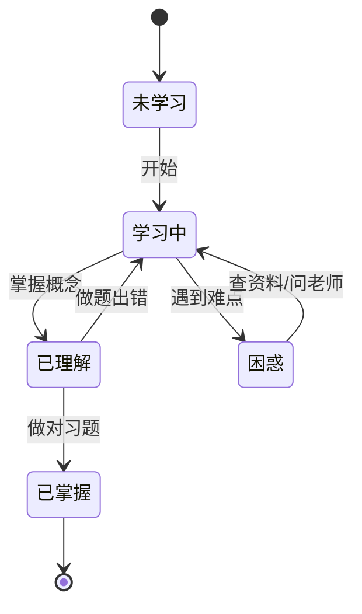

# 🎨 Mermaid 图表功能演示

> wouldkeep.com 现已支持 **Mermaid** 图表渲染！在任何笔记中用 ` ```mermaid ` 代码块即可画图。

---

## 流程图（Flowchart）



---

## 知识图谱（概念关系）



---

## 时间线（甘特图）



---

## 序列图



---

## 数学分类（思维导图）



---

## 状态图



---

> [!tip] 使用提示
> - Mermaid 代码块支持**缩放**和**拖拽平移**（右下角按钮）
> - 点击`⊕`按钮可以**全屏查看**大图
> - 暗色模式下图表会**自动适配**配色
> - 更多图表类型：[Mermaid 官方文档](https://mermaid.js.org/)
