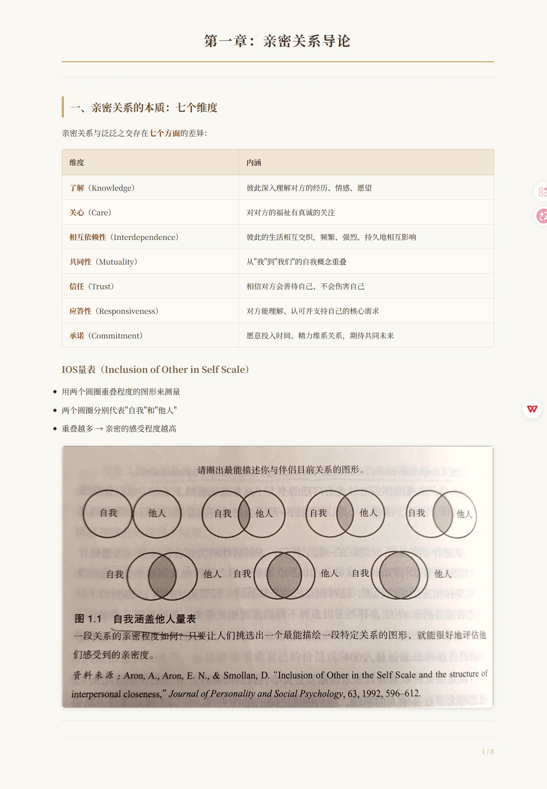
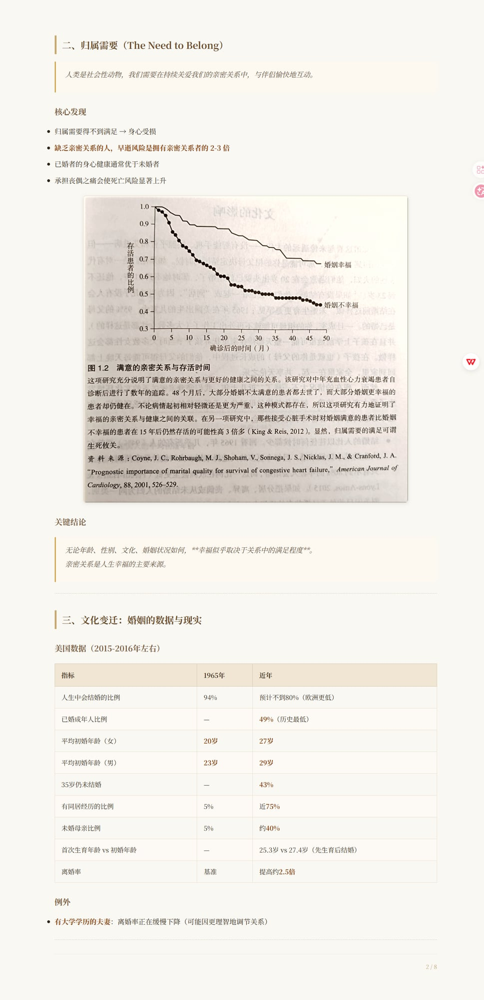
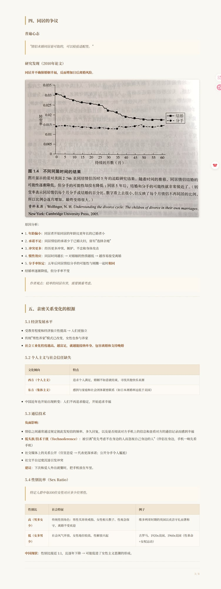
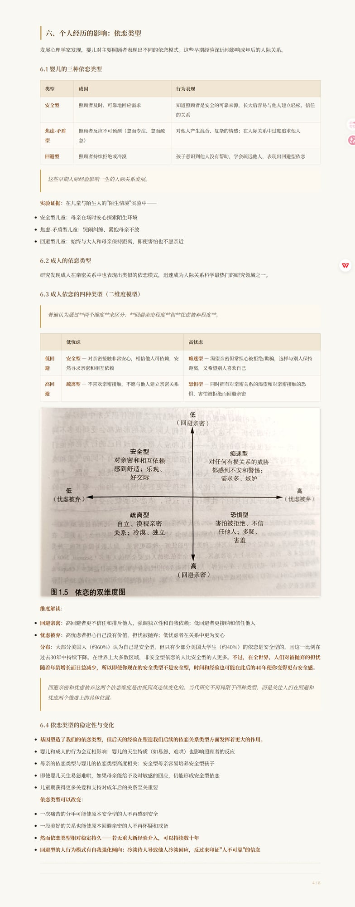
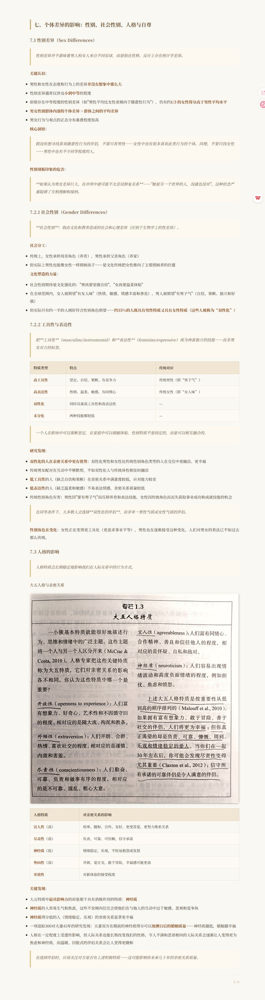
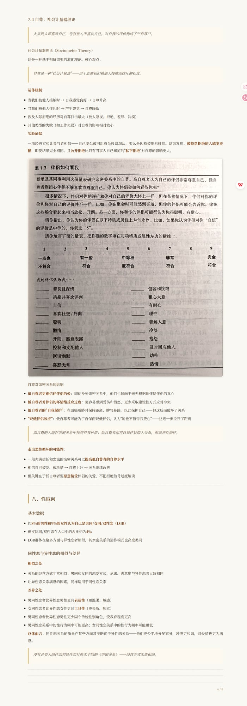
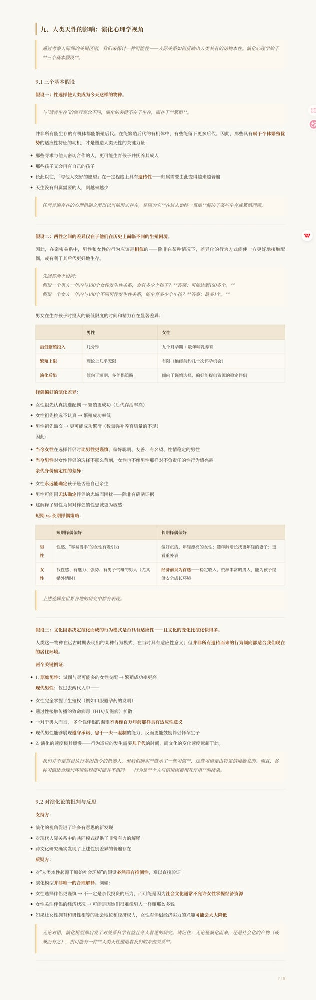
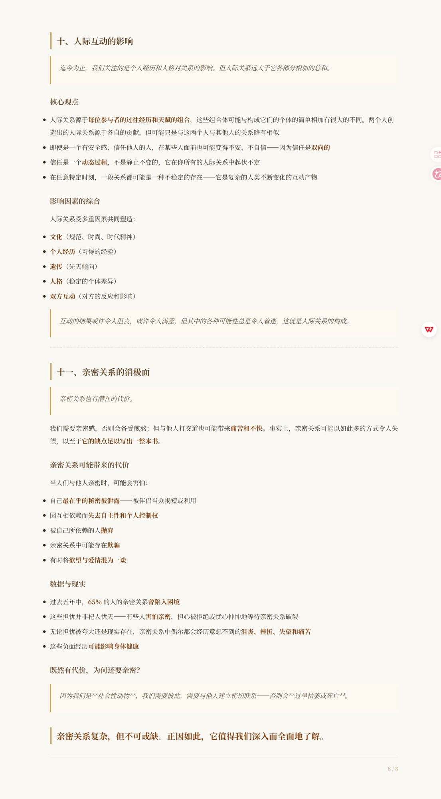

# 亲密关系——读书笔记

> 作者：罗兰·米勒（Rowland Miller）
> 整理时间：2026-05-16至2026-05-17

---

# 第一章：亲密关系导论

---

## 一、亲密关系的本质：七个维度

亲密关系与泛泛之交存在**七个方面**的差异：

| 维度 | 内涵 |
| --- | --- |
| **了解**（Knowledge） | 彼此深入理解对方的经历、情感、愿望 |
| **关心**（Care） | 对对方的福祉有真诚的关注 |
| **相互依赖性**（Interdependence） | 彼此的生活相互交织，频繁、强烈、持久地相互影响 |
| **共同性**（Mutuality） | 从"我"到"我们"的自我概念重叠 |
| **信任**（Trust） | 相信对方会善待自己、不会伤害自己 |
| **应答性**（Responsiveness） | 对方能理解、认可并支持自己的核心需求 |
| **承诺**（Commitment） | 愿意投入时间、精力维系关系，期待共同未来 |

### IOS量表（Inclusion of Other in Self Scale）

- 用两个圆圈重叠程度的图形来测量
- 两个圆圈分别代表"自我"和"他人"
- 重叠越多 → 亲密的感受程度越高

---

## 二、归属需要（The Need to Belong）

> 人类是社会性动物，我们需要在持续关爱我们的亲密关系中，与伴侣愉快地互动。

### 核心发现

- 归属需要得不到满足 → 身心受损
- **缺乏亲密关系的人，早逝风险是拥有亲密关系者的 2-3 倍**
- 已婚者的身心健康通常优于未婚者
- 承担丧偶之痛会使死亡风险显著上升

### 关键结论

> 无论年龄、性别、文化、婚姻状况如何，**幸福似乎取决于关系中的满足程度**。
> 亲密关系是人生幸福的主要来源。

---

## 三、文化变迁：婚姻的数据与现实

### 美国数据（2015-2016年左右）

| 指标 | 1965年 | 近年 |
| --- | --- | --- |
| 人生中会结婚的比例 | 94% | 预计不到80%（欧洲更低） |
| 已婚成年人比例 | — | **49%**（历史最低） |
| 平均初婚年龄（女） | **20岁** | **27岁** |
| 平均初婚年龄（男） | **23岁** | **29岁** |
| 35岁仍未结婚 | — | **43%** |
| 有同居经历的比例 | 5% | 近**75%** |
| 未婚母亲比例 | 5% | 约**40%** |
| 首次生育年龄 vs 初婚年龄 | — | 25.3岁 vs 27.4岁（先生育后结婚） |
| 离婚率 | 基准 | 提高约**2.5倍** |

### 例外

- **有大学学历的夫妻**：离婚率正在缓慢下降（可能因更理智地调节关系）

---

## 四、同居的争议

### 普遍心态

> "情侣未婚同居是可取的，可以检验适配性。"

### 研究发现（2010年论文）

**同居并不确保婚姻幸福，反而增加日后离婚风险。**

原因分析：

1. **年龄偏小**：同居者开始同居的年龄比更年长的已婚者小
2. **承诺不足**：同居情侣的承诺少于已婚夫妇，留有"选择余地"
3. **冲突更多**：经历更多冲突、嫉妒、不忠和身体攻击
4. **惯性效应**：同居时间越长 → 对婚姻的热情越低 → 越容易接受离婚
5. **分手率恒定**：五年后同居情侣分手的可能性与刚搬一起时**相同**
   - 结婚率逐渐降低，但分手率不变

> 作者观点：轻率的同居有害，需要慎重考虑。

---

## 五、亲密关系变化的根源

### 5.1 经济发展水平

- 受教育程度和经济独立性提高 → 人们更独立
- 传统"男性养家"模式已改变，女性也参与养家
- **社会工业化程度越高、越富足，就越能接纳单身、包容离婚和支持晚婚**

### 5.2 个人主义与社会信任缺失

| 文化倾向 | 特点 |
| --- | --- |
| **西方（个人主义）** | 追求个人满足，婚姻不如意就结束，寻找其他快乐来源 |
| **东方（集体主义）** | 感到与家庭和社会团体紧密联系（如日本离婚率远低于美国） |

- 中国近年也开始出现转变：人们不再追求稳定，开始追求幸福

### 5.3 通信技术

**负面影响**：
- 情侣之间通常通过规定彼此发短信的频率、多久回复，以及是否阅读对方手机上的信息和查看对方的通信记录而感到幸福
- **低头族/技术干扰（Technoference）**：被引诱"优先考虑不在身边的人而忽视自己身边的人"（伴侣在身边，手机一响先看手机）
- 社交媒体上的关系公开（官宣恋爱 → 代表更深承诺；公开分手令人尴尬）
- 社交平台过度沉迷引发冲突

**建议**：下次和爱人外出就餐时，把手机放在车里。

### 5.4 性别比率（Sex Ratio）

> 特定人群中每100位女性对应多少位男性。

| 性别比 | 社会特征 | 例子 |
| --- | --- | --- |
| **高（男多女少）** | 传统性别角色：男性买昂贵戒指、女性相夫教子、性观念保守、离婚不受欢迎 | 维多利亚时期的英国以贞洁守礼而著称 |
| **低（女多男少）** | 社会风气开放、女性地位较高、性解放兴起 | 古罗马、1920s美国、1960s美国（性革命+女权运动） |

**中国现状**：性别比接近 1:1，且逐年下降 → 可能促进了女性主义思潮的形成。

---

## 六、个人经历的影响：依恋类型

发展心理学家发现，婴儿对主要照顾者表现出不同的依恋模式。这些早期经验深远地影响成年后的人际关系。

### 6.1 婴儿的三种依恋类型

| 类型 | 成因 | 行为表现 |
| --- | --- | --- |
| **安全型** | 照顾者及时、可靠地回应需求 | 知道照顾者是安全的可靠来源，长大后容易与他人建立轻松、信任的关系 |
| **焦虑-矛盾型** | 照顾者反应不可预测（忽而专注、忽而疏忽） | 对他人产生混合、复杂的情感；在人际关系中过度追求他人 |
| **回避型** | 照顾者持续拒绝或冷漠 | 孩子意识到他人没有帮助，学会疏远他人，表现出回避型依恋 |

> 这些早期人际经验影响一生的人际关系发展。

**实验证据**：在儿童与陌生人的"陌生情境"实验中——
- 安全型儿童：母亲在场时安心探索陌生环境
- 焦虑-矛盾型儿童：哭闹纠缠、紧抱母亲不放
- 回避型儿童：始终与大人和母亲保持距离，即使害怕也不愿亲近

### 6.2 成人的依恋类型

研究发现成人在亲密关系中也表现出类似的依恋模式，迅速成为人际关系科学最热门的研究领域之一。

### 6.3 成人依恋的四种类型（二维度模型）

> 普遍认为通过**两个维度**来区分：**回避亲密程度**和**忧虑被弃程度**。

|         | 低忧虑                                     | 高忧虑                                          |
| ------- | --------------------------------------- | -------------------------------------------- |
| **低回避** | **安全型** — 对亲密接触非常安心，相信他人可依赖，安然寻求亲密和相互依赖 | **痴迷型** — 渴望亲密但常担心被拒绝/欺骗，选择与别人保持距离，又希望别人喜欢自己 |
| **高回避** | **疏离型** — 不喜欢亲密接触，不愿与他人建立亲密关系           | **恐惧型** — 同时拥有对亲密关系的渴望和对亲密接触的恐惧，害怕被拒绝而回避亲密   |

**维度解读**：

- **回避亲密**：高回避者更不信任和排斥他人，强调独立性和自我依赖；低回避者更接纳和信任他人
- **忧虑被弃**：高忧虑者担心自己没有价值，担忧被抛弃；低忧虑者在关系中更为安心

**分布**：大部分美国人（约60%）认为自己是安全型，但只有少部分美国大学生（约40%）的依恋是安全型的，且这一比例在过去30年中持续下降。在世界上大多数区域，非安全型依恋的人比安全型的人更多。**不过，在全世界，人们对被抛弃的担忧随着年龄增长而日益减少，所以即使你现在的安全类型不是安全型，时间和经验也可能在此后的40年使你变得更有安全感。**

> 回避亲密和忧虑被弃这两个依恋维度是由低到高连续变化的。当代研究不再局限于四种类型，而是关注人们在回避和忧虑两个维度上的具体位置。

### 6.4 依恋类型的稳定性与变化

- **基因塑造了我们的依恋类型，但后天的经验在塑造我们后续的依恋关系类型方面发挥着更大的作用。**
- 婴儿和成人的行为会互相影响：婴儿的天生特质（如易怒、难哄）也影响照顾者的反应
- 母亲的依恋类型与婴儿的依恋类型高度相关：安全型母亲容易培养安全型孩子
- 即使婴儿天生易怒难哄，如果母亲能给予及时敏感的回应，仍能形成安全型依恋
- 儿童期获得更多关爱和支持对成年后的关系至关重要

**依恋类型可以改变**：
- 一次痛苦的分手可能使原本安全型的人不再感到安全
- 一段美好的关系也能使原本回避亲密的人不再怀疑和戒备
- **然而依恋类型相对稳定持久——若无重大新经验介入，可以持续数十年**
- **回避型的人行为模式有自我强化倾向：冷淡待人导致他人冷淡回应，反过来印证"人不可靠"的信念**

---

## 七、个体差异的影响：性别、社会性别、人格与自尊

### 7.1 性别差异（Sex Differences）

> 性别差异并不意味着男人和女人来自不同星球，而是指在性格、反应上存在统计学差异。

**关键认识**：

- 男性和女性在态度和行为上的差异**并没有想象中那么大**
- 性别差异通常仅涉及**小到中等**的程度
- 即使存在中等程度的性别差异（如"男性平均比女性更倾向于随意性行为"），仍有约**1/3 的女性得分高于男性平均水平**
- **男女性别群体内部的个体差异 > 群体之间的平均差异**
- 男女行为与观点的正态分布重叠程度很高

**核心洞察**：
> 假设你想寻找喜欢随意性行为的伴侣，不要只看男性——女性中也有很多喜欢此类行为的个体。同理，不要只找女性——男性中也有不少同等程度的人。

**性别刻板印象的危害**：
> **如果认为男女差异巨大，在冲突中就可能不太尝试修复关系**——"她是另一个世界的人，沟通也没用"。这种信念严重阻碍了互相理解和接纳。

### 7.2.1 社会性别（Gender Differences）

> **社会性别**：指由文化和教养造成的社会和心理差异（区别于生物学上的性差异）。

**社会分工**：
- 传统上，女性承担母亲角色（养育），男性承担父亲角色（养家）
- 但实际上男性也能像女性一样照顾孩子——是文化传统把女性推向了主要照顾者的位置

**文化塑造的力量**：
- 社会性别期待是文化强化的："男孩要坚强自信"，"女孩要温柔体贴"
- 在全球范围内，女人被期望"有女人味"（热情、敏感、情感丰富和善良），男人被期望"有男子气"（自信、果断、独立和好强）
- 但实际只有约一半的人刚好符合性别角色期望——**约35%的人既具有男性特质又具有女性特质（这些人被称为“双性化”）**

### 7.2.2 工具性与表达性

> 把**工具性**（masculine/instrumental）和**表达性**（feminine/expressive）视为两套独立的技能——而非男女对立的标签。

| 特质类型     | 特点            | 传统对应         |
| -------- | ------------- | ------------ |
| **高工具性** | 坚定、自信、果断、有竞争力 | 传统男性（即“男子气”） |
| **高表达性** | 热情、温柔、敏感、有同情心 | 传统女性（即“女人味”） |
| **双性化**  | 同时具备高工具性和高表达性 | —            |
| **未分化**  | 两种技能都较低       | —            |

> 一个人在职场中可以果断坚定，在家庭中可以细腻体贴。性别特质不是固定的，而是可以相互融合的。

**研究发现**：
- **双性化的人在亲密关系中更有优势**：双性化男性和女性比传统性别角色类型的人在交往中更融洽、更幸福
- 传统男女配对在互动中不够默契，不如双性化人与传统异性相处时融洽
- **低工具性**的人（缺乏自信和果断）在亲密关系中满意度较低，应对能力较差
- **低表达性**的人（缺乏温柔和敏感）不易表达情感，亲密关系质量较低
- 传统性别角色有害：男性因"要有男子气"而压抑养育和表达技能，女性因传统角色而丧失获取事业成功和成就技能的机会

> 在同等条件下，大多数人会选择**双性化的伴侣**，而非单一男性气质或女性气质的伴侣。

**性别角色在变化**：女性正在变得更工具化（更追求事业平等），男性也在逐渐接受这种变化。人们对男女的看法已不如过去那么传统。

### 7.3 人格的影响

> 人格特质会长期稳定地影响我们在人际关系中的行为方式。

#### 大五人格与亲密关系

| 人格特质       | 对亲密关系的影响                 |
| ---------- | ------------------------ |
| **宜人性**（高） | 坦率、随和、合作、友好，更受喜爱，更努力维系关系 |
| **尽责性**（高） | 负责、可靠、可信赖，信守承诺           |
| **神经质**（低） | 情绪稳定、乐观，不轻易抱怨或发怒         |
| **外向性**（高） | 开朗、爱社交、敢于冒险，幸福感可能更高      |
| **开放性**    | 对新体验的接受程度                |

**关键发现**：
- 大五特质中**最具影响力**的却是那个具有消极作用的特质：**神经质**
- **神经质**的人容易生气和焦虑，这些不良倾向往往会使他们在与他人的互动中过于敏感、悲观和爱争执
- **神经质**得分低的人（情绪稳定、乐观）的亲密关系显著更幸福
- 一项追踪300对夫妻45年的研究发现：夫妻双方在婚前的神经质得分可以**预测日后的婚姻质量**——神经质越低，婚姻越幸福
- 人格在一定程度上受遗传影响，但人际关系也能长期改变我们的性格。令人不满和恶语相向的人际关系会逐渐让人变得更为焦虑和神经质，而温暖、回报式的伴侣关系会让人变得更随和

> 在选择伴侣时，应该关注对方是否有上述积极特质——这可能影响你未来几十年的亲密关系质量。

### 7.4 自尊：社会计量器理论

> 大多数人都喜欢自己，也有些人不喜欢自己。对自我的评价构成了**自尊**。

#### 社会计量器理论（Sociometer Theory）

这是一种基于归属需要的演化理论。核心观点：

> 自尊是一种"社会计量器"——用于监测我们被他人接纳或排斥的程度。

**运作机制**：
- 当我们被他人接纳时 → 自我感觉良好 → 自尊升高
- 当我们被他人排斥时 → 产生警觉 → 自尊降低
- 涉及人际拒绝的经历对自尊打击最大（被人忽视、拒绝、羞辱、冷漠）
- 其他类型的失败（如工作失误）对自尊的影响相对较小

**实验证据**：
一项经典实验让参与者相信——自己要么被同组成员投票淘汰，要么是因故被随机排除。结果发现：**被投票拒绝的人感觉更糟**，即使结果完全相同。且**公开拒绝**比只有当事人自己知道的"**私下拒绝**"对自尊的影响更大。

#### 自尊对亲密关系的影响

- **低自尊者更难信任伴侣的爱**：即使身处亲密关系中，他们也倾向于毫无根据地怀疑伴侣的真心
- **低自尊者对伴侣的坏情绪反应过度**：更容易感到受伤和愤怒，更少采取建设性方式应对冲突
- **低自尊者的"自我保护"**：在面临威胁时保持距离、脾气暴躁，以此保护自己——但这反而破坏了关系
- **"贬低伴侣效应"**：低自尊者可能为了自保而贬低伴侣，认为"她也不值得我费心"——这进一步拉开了距离

> 高自尊的人能在亲密关系中找到自我价值；低自尊者却将自我怀疑带入关系，形成恶性循环。

**走出恶性循环的可能性**：
- 一段充满信任和忠诚的亲密关系可以**提高低自尊者的自尊水平**
- 相信自己被爱、被珍惜 → 自尊上升 → 关系继续改善
- 但关键在于低自尊者要**愿意接受**伴侣的关爱，不把拒绝信号过度解读

---

## 八、性取向

### 基本数据

- 约**8%的男性和9%的女性认为自己是男同/女同/双性恋（LGB）**
- 但实际同/双性恋在人口中的占比约为**4%**
- LGB群体在诸多方面与异性恋者相似，其亲密关系的运作模式也高度类同

### 同性恋与异性恋的相似与差异

**相似之处**：
- 关系的经营方式非常相似：男同和女同的恋爱方式、承诺、满意度与异性恋者大致相同
- 让异性恋关系满意的因素，同样适用于同性恋关系

**差异之处**：
- 男同性恋者比异性恋男性更具**表达性**（更温柔、敏感）
- 女同性恋者比异性恋女性更具**工具性**（更果断、独立）
- 男同性恋者比异性恋男性更少固守传统性别角色，受教育程度更高
- 男同性恋关系中的性行为频率可能更高；女同性恋关系中的性行为频率可能更低

**总体而言**：同性恋关系的质量在某些方面甚至略优于异性恋关系——他们更公平地分配家务，冲突更和谐，对爱情也更为满意。

> 没有必要为同性恋和异性恋写两本不同的《亲密关系》——经营方式本质相同。

---

---

## 九、人类天性的影响：演化心理学视角

> 通过考察人际间的关键区别，我们来探讨一种可能性——人际关系如何反映出人类共有的动物本性。演化心理学始于**三个基本假设**。

### 9.1 三个基本假设

**假设一：性选择使人类成为今天这样的物种。**

> 与"适者生存"的流行观念不同，演化的关键不在于生存，而在于**繁殖**。

并非所有能生存的有机体都能繁殖后代。在能繁殖后代的有机体中，有些能留下更多后代。因此，那些具有**赋予个体繁殖优势**的适应性特征的动机，才是塑造人类天性的关键力量：

- 那些寻求与他人密切合作的人，更可能生育孩子并抚养其成人
- 那些孩子又会再有自己的孩子
- 长此以往，「与他人交好的愿望」在一定程度上具有**遗传性**——归属需要由此变得越来越普遍
- 天生没有归属需要的人，则越来越少

> 任何普遍存在的心理机制之所以以当前形式存在，是因为它**在过去始终一贯地**解决了某些生存或繁殖问题。

---

**假设二：两性之间的差异仅在于他们在历史上面临不同的生殖困境。**

因此，在亲密关系中，男性和女性的行为应该是**相似**的——除非在某种情况下，差异化的行为方式能使一方更好地接触配偶，或有利于其后代更好地生存。

> 先回答两个设问：
>  假设一个男人一年内与100个女性发生性关系，会有多少个孩子？**答案：可能达到100多个。**
>  假设一个女人一年内与100个不同男性发生性关系，能生育多少个小孩？**答案：最多1个。**

男女在生育孩子时投入的最低限度的时间和精力存在显著差异：

| | 男性 | 女性 |
| --- | --- | --- |
| **最低繁殖投入** | 几分钟 | 九个月孕期 + 数年哺乳养育 |
| **繁殖上限** | 理论上几乎无限 | 有限（绝经前约几十次怀孕机会） |
| **演化后果** | 倾向于短期、多伴侣策略 | 倾向于谨慎选择、偏好能提供资源的稳定伴侣 |

**择偶偏好的演化差异**：

- 女性祖先认真挑选配偶 → 繁殖更成功（后代存活率高）
- 女性祖先挑选不认真 → 繁殖成功率低
- 男性祖先滥交 → 更可能成功繁衍（数量弥补养育质量的不足）

因此：
- **当今女性**在选择伴侣时**比男性更谨慎**，偏好聪明、友善、有名望、性情稳定的男性
- **当今男性**对女性伴侣的选择不那么苛刻，女性也不像男性那样对不负责任的性行为感兴趣

**亲代身份确定性的差异**：
- 女性**永远能确定**孩子是否是自己亲生
- 男性可能因**无法确定**伴侣的忠诚而困扰——除非有确凿证据
- 这解释了男性为何对伴侣的性忠诚更为敏感

**短期 vs 长期择偶策略**：

| | 短期择偶偏好 | 长期择偶偏好 |
| --- | --- | --- |
| **男性** | 性感、"容易得手"的女性有吸引力 | 偏好贞洁、年轻漂亮的女性；随年龄增长找更年轻的妻子；更看重外表 |
| **女性** | 找性感、有魅力、强势、有男子气概的男人（尤其婚外情时） | **经济前景为首选**——稳定收入、资源丰富的男人，能为孩子提供安全成长环境 |

> 上述差异在世界各地的研究中都有表现。

---

**假设三：文化因素决定演化而成的行为模式是否具有适应性——且文化的变化比演化快得多。**

人类这一物种在远古时期表现出的某种行为模式，在当时具有适应性意义；但**并非所有遗传而来的行为倾向都适合我们现在的居住环境**。

**两个关键例证**：

1. **原始男性**：试图与尽可能多的女性交配 → 繁殖成功率更高
   **现代男性**：仅过去两代人中——
   - 女性完全掌握了生殖权（例如口服避孕药的发明）
   - 通过性接触传播的致命病毒（HIV/艾滋病）扩散
   - →对于男人而言， 多个性伴侣的渴望**不再像百万年前那样具有适应性意义**
   - 现代男性能够展现**遵守承诺、忠于一夫一妻制**的能力，反而更能鼓励伴侣怀孕生子

2. 演化的速度极其缓慢——行为适应的发生需要**几千代**的时间，而文化的变化速度远超于此。

> 我们并不是盲目执行基因指令的机器人，但我们确实**继承了一些习惯**，这些习惯是由特定情境触发的。而且，各种习惯适合现代环境的程度可能并不相同——行为是**个人与情境因素相互作用**的结果。

---

### 9.2 对演化论的批判与反思

**支持方**：
- 演化的视角促进了许多有意思的新发现
- 对现代人际关系中的共同模式提供了非常有力的解释
- 跨文化研究确实发现了上述性别差异的普遍存在

**质疑方**：
- 对"人类本性起源于原始社会环境"的假设**必然带有推测性**，难以直接验证
- 演化模型**并非唯一的合理解释**。例如：
  - 女性选择伴侣更谨慎 → 不一定是亲代投资的压力，而可能是因为**社会文化通常不允许女性掌握经济资源**
  - 女性关注伴侣的经济状况 → 可能是因她们很难像男人一样赚那么多钱
  - 如果让女性拥有和男性相等的社会地位和经济权力，女性对伴侣经济实力的兴趣**可能会大大降低**

> 无论对错，演化模型都启发了对关系科学有益且令人着迷的研究。请记住：无论是演化而来，还是社会化的产物（或兼而有之），很可能有一种**人类天性塑造着我们的亲密关系**。

---

## 十、人际互动的影响

> 迄今为止，我们关注的是个人经历和人格对关系的影响。但人际关系远大于它各部分相加的总和。

### 核心观点

- 人际关系源于**每位参与者的过往经历和天赋的组合**，这些组合体可能与构成它们的个体的简单相加有很大的不同。两个人创造出的人际关系源于各自的贡献，但可能只是与这两个人与其他人的关系略有相似
- 即使是一个有安全感、信任他人的人，在某些人面前也可能变得不安、不自信——因为信任是**双向的**
- 信任是一个**动态过程**，不是静止不变的，它在你所有的人际关系中起伏不定
- 在任意特定时刻，一段关系都可能是一种不稳定的存在——它是复杂的人类不断变化的互动产物

### 影响因素的综合

人际关系受多重因素共同塑造：

- **文化**（规范、时尚、时代精神）
- **个人经历**（习得的经验）
- **遗传**（先天倾向）
- **人格**（稳定的个体差异）
- **双方互动**（对方的反应和影响）

> 互动的结果或许令人沮丧，或许令人满意，但其中的各种可能性总是令人着迷，这就是人际关系的构成。

---

## 十一、亲密关系的消极面

> 亲密关系也有潜在的代价。

我们需要亲密感，否则会备受煎熬；但与他人打交道也可能带来**痛苦和不快**。事实上，亲密关系可能以如此多的方式令人失望，以至于**它的缺点足以写出一整本书**。

### 亲密关系可能带来的代价

当人们与他人亲密时，可能会害怕：

- 自己**最在乎的秘密被泄露**——被伴侣当众揭短或利用
- 因互相依赖而**失去自主性和个人控制权**
- 被自己所依赖的人**抛弃**
- 亲密关系中可能存在**欺骗**
- 有时将**欲望与爱情混为一谈**

### 数据与现实

- 过去五年中，**65%** 的人的亲密关系**曾陷入困境**
- 这些担忧并非杞人忧天——有些人**害怕亲密**，担心被拒绝或忧心忡忡地等待亲密关系破裂
- 无论担忧被夸大还是现实存在，亲密关系中偶尔都会经历意想不到的**沮丧、挫折、失望和痛苦**
- 这些负面经历**可能影响身体健康**

### 既然有代价，为何还要亲密？

> 因为我们是**社会性动物**，我们需要彼此，需要与他人建立密切联系——否则会**过早枯萎或死亡**。

##        **亲密关系复杂，但不可或缺。正因如此，它值得我们深入而全面地了解。**

