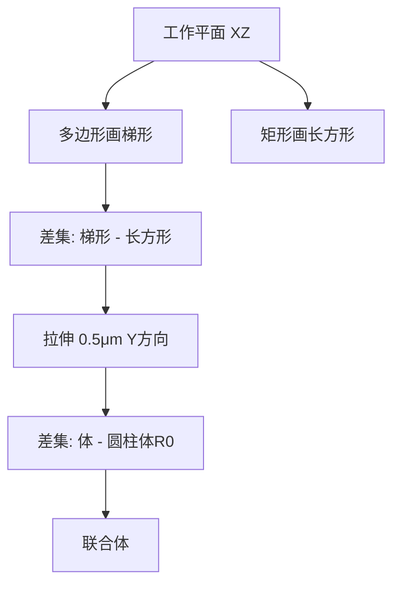

# 01 基本建模流程与多物理场耦合

> 📌 COMSOL 多物理场仿真基础强化培训 · 训练营1 · 150 分钟 · 讲师：魏安然（COMSOL 中国应用工程师）

![[COMSOL 训练营1_基本建模流程.mp4]]

---

## 一、COMSOL 公司简介与软件概览

- **COMSOL** 公司 1986 年成立于瑞典斯德哥尔摩，全球设有 17 个分支机构
- 旗舰产品 **COMSOL Multiphysics** — 多物理场仿真平台软件
- 核心理念：在同一软件平台、相同操作界面对不同物理现象进行统一仿真

### 产品体系

| 类别 | 内容 |
|------|------|
| **核心平台** | COMSOL Multiphysics — 模型开发器 + 多物理场耦合 |
| **专业模块** | 电磁、流体传热、结构力学、声学、化工等 |
| **多功能模块** | 优化、不确定性量化等 |
| **接口模块** | Live Link（与 CAD 软件协同仿真） |
| **应用工具** | **App 开发器**（封装仿真模型）、**模型管理器**（管理模型与 App） |
| **部署产品** | COMSOL Compiler（编译可执行文件）、COMSOL Server（部署管理） |

> 💡 软件最大特色：不同物理场的耦合方式灵活、添加个数不限、耦合方式不限。

---

## 二、建模前的思考

在正式建模之前，需要先理清以下问题：

- **简化与等效**：是否能简化？100% 仿真计算量往往难以承受
- **物理过程**：研究对象包含哪些物理过程？发生在哪些区域？
- **耦合关系**：不同物理过程之间以什么方式相互影响？（双向/单向耦合）
- **初始条件**：仿真对象是否有初始状态？
- **边界条件**：存在哪些约束或环境变量？
- **分析类型**：稳态、准静态、瞬态？需选择合适的分析类型
- **拓展考虑**：是否需要开发 App、版本管理？

---

## 三、演示案例：微阻梁电致热变形

### 物理背景

微阻梁常用于 **MEMS 器件**。施加电压 → 电流通过 → **焦耳热效应** → 温度升高 → 结构**热膨胀** → 热变形 → 调控安装装置的运动和位置。

### 三场耦合关系

| 物理场 | 控制方程 | 因变量 | 耦合关系 |
|--------|----------|--------|----------|
| **电流场（电场）** | 电流守恒方程 | 电势 $V$ | → 焦耳热作为热源 |
| **固体传热（温度场）** | 热传导方程 | 温度 $T$ | ← 电导率随温度变化 / → 热膨胀驱动 |
| **固体力学（结构场）** | 小变形线弹性理论 | 位移 $\mathbf{u}$ | ← 温度 → 热应变 |


- **电 ↔ 热**：双向耦合（电发热 + 温度影响电导率）
- **热 → 力**：单向耦合（温度引起热膨胀，热应变正比于温升 × 热膨胀系数 α）

### 边界条件

| 物理场 | 边界条件 |
|--------|----------|
| 电流 | 一端接地（0 V），另一端施加电压（0.2 V），其余面电绝缘 |
| 传热 | 底部两端面恒温 20°C，其余表面自然对流换热（$h = 5\ \mathrm{W/(m^2·K)}$） |
| 力学 | 底部两端面固定约束，其余自由 |

> ⚠️ **材料热敏性**：材料属性（如电导率）随温度变化，需在模型中考虑以获得准确结果。

---

## 四、软件界面与建模工作流

### 界面布局

| 区域 | 功能 |
|------|------|
| **功能区**（顶部） | 选项卡，包含建模所需的条件和功能 |
| **模型开发器**（左侧） | 模型树，节点按建模流程排列 |
| **设置窗口**（中间） | 点击模型树节点时弹出，配置参数和条件 |
| **图形窗口**（右侧） | 几何和结果显示区，配有常用工具栏 |

### 模型树流程（自上而下）

```
全局定义 → 几何 → 材料 → 物理场 → 多物理场 → 网格 → 研究 → 结果
```

### 模型向导

- 选择**空间维度**：三维 / 二维 / 二维轴对称 / 一维轴对称 / 一维 / 零维
- 选择**物理场**：可按分类查找，也可使用预配置的多物理场接口（如「焦耳热和热膨胀」）
- 选择**研究类型**：稳态、瞬态等

---

## 五、从简单到复杂：逐步添加物理场

> 💡 **推荐策略**：物理场由少到多，耦合效应由简单到复杂，逐步调试。

- 预配置的「焦耳热和热膨胀」接口已包含三场 + 两耦合节点
- 教学演示分两步：
  1. **先电磁热**：电流 + 固体传热 + 电磁热耦合
  2. **再加力学**：添加固体力学 + 热膨胀耦合

### 禁用/启用节点

> 💡 任何模型树节点均可右键选择「**禁用**」使其失效，适用于手动耦合时屏蔽默认耦合节点。

---

## 六、全局参数定义

### 定义方式

在「全局定义 → 参数」节点中添加参数，格式：`名称 = 值 [单位]`

### 演示案例参数

| 参数名 | 含义 | 初始值 |
|--------|------|--------|
| `R0` | 孔半径 | 0.1 [μm] |
| `X0` | 孔中心 X 坐标 | 0 |
| `V0` | 施加电压 | 0.2 [V] |
| `H0` | 对流换热系数 | 5 [W/(m²·K)] |

### 使用参数的好处

- **统一修改**：修改参数值，所有引用处自动更新
- **参数化扫描**：在研究计算中逐个扫描参数值
- **App 开发**：App 中输入的值即是对参数的赋值

> ⚠️ 参数属于**全局量**，在模型各节点均可调用。

---

## 七、几何建模

### 建模思路

微阻梁厚度均匀 → 2D 截面拉伸成体 → 布尔减圆柱体打孔



### 操作要点

| 步骤 | 操作 | 关键设置 |
|------|------|----------|
| 1. 修改单位 | 几何节点 → 长度单位 | 改为 μm |
| 2. 创建工作平面 | 右键几何 → 工作平面 | 对齐 XZ 平面 |
| 3. 绘制梯形 | 工作平面 → 多边形 | 输入各顶点坐标 |
| 4. 绘制矩形 | 工作平面 → 矩形 | 宽 0.8，高 0.25，左下角 (0.4, 0) |
| 5. 布尔差集 | 工作平面 → 差集 | 梯形减去矩形 |
| 6. 拉伸 | 工作平面 → 拉伸 | 厚度 0.5 μm |
| 7. 创建圆柱体 | 几何 → 圆柱体 | 半径 = `R0`，高度足够贯穿 |
| 8. 打孔 | 几何 → 差集 | 体减去圆柱体 |
| 9. 生成联合体 | 几何 → 构建所有对象 | 形成统一对象 |

### 图形操作

| 操作 | 快捷键/方式 |
|------|------------|
| 缩放 | 按住鼠标中键 + 上下移动 |
| 平移 | 按住鼠标右键 + 移动 |
| 旋转（3D） | 按住鼠标左键 + 拖动 |
| 线框渲染 | 点击线框按钮 |
| 透明展示 | 点击透明按钮 |
| 剪裁平面 | 添加剪裁平面工具 |
| 隐藏/显示 | 隐藏按钮 → 点击对象 → 重置隐藏 |
| 快速恢复默认视图 | 点击坐标轴小工具 |

> 💡 更多几何建模功能见第二部分培训。

---

## 八、材料分配

### 从材料库添加

右键材料 → 从库中添加材料 → 按场景分类（电池/传热/压电/半导体等）查找 → 双击添加

- 材料库自动配置该物理场所需的属性（如电导率、导热系数、热容等）
- 空缺属性需自行查找或测试补填

### 热敏性材料属性

材料属性可写成温度的函数：

```
电导率 = 基准值 - 0.001 * T[1/K]
```

> ⚠️ **注意量纲一致**：温度 T 单位为 K，表达式中的系数需配合单位。

---

## 九、物理场设置

### 电流场

| 条件 | 节点 | 位置 |
|------|------|------|
| 接地 | 右键电流 → 接地 | 右端面 |
| 施加电压 | 右键电流 → 终端 → 电压 | 左端面，值为 `V0` |
| 默认 | 电流守恒 + 电绝缘（所有面） | — |

### 固体传热

| 条件 | 节点 | 位置 |
|------|------|------|
| 对流换热 | 右键固体传热 → 热通量 → 对流热通量 | 所有表面（Ctrl+A 全选），$h = H0$，$T_{ext} = 20\ \mathrm{°C}$ |
| 恒温边界 | 右键固体传热 → 温度 | 底部两底面，$T = 20\ \mathrm{°C}$ |

### 条件替代关系

> 💡 展开节点的「**替代和共存**」可查看哪些默认条件被新添加的条件覆盖。图形窗口中蓝色区域表示当前条件实际生效的边界。

### 固体力学（第二步添加）

| 条件 | 节点 | 位置 |
|------|------|------|
| 固定约束 | 右键固体力学 → 固定约束 | 底部两底面 |
| 默认 | 线弹性材料模型 + 自由边界 | — |

---

## 十、多物理场耦合

### 内置耦合节点

| 耦合节点 | 连接场 | 耦合机制 |
|----------|--------|----------|
| **电磁热** | 电流 ↔ 固体传热 | 焦耳热 $Q = \mathbf{J} \cdot \mathbf{E}$ 作为热源 |
| **热膨胀** | 固体传热 → 固体力学 | 热应变 $\varepsilon_{th} = \alpha \cdot \Delta T$ |

### 手动耦合原理

> 🔑 **核心机制**：在不同物理场的控制方程中**互相调用对方物理场求解出的变量**。

手动设置电磁热耦合的步骤：
1. 禁用内置的「电磁热」耦合节点
2. 在固体传热下右键添加「热源」（域条件）
3. 热源表达式选择「**体积损耗密度，电磁**」（即 $\mathbf{J} \cdot \mathbf{E}$）
4. 或自定义表达式：`ec.Jx*ec.Ex + ec.Jy*ec.Ey + ec.Jz*ec.Ez`

### 查看变量表达式

> 💡 在模型开发器中勾选「**方程视图**」（通过眼睛按钮 → 显示更多选项），可在每个物理场节点下查看变量的解析表达式，追溯耦合关系的数学形式。

### 材料中的耦合

材料属性中调用温度变量 `T`（如电导率随温度线性变化），本质上也是不同物理场变量之间的互相调用。

> ⚠️ 推荐优先使用软件内置的耦合节点，减少手动设置可能出现的疏忽或错误。

---

## 十一、网格划分基础

- 右键网格 → 全部构建，自动划分
- 预置 **9 个层级**：极细 → 极粗
- 圆孔边等曲面区域会自动细化
- 可选择「由物理场控制」的网格尺寸

> 💡 更多网格功能见第三部分培训。

---

## 十二、研究计算与结果可视化

### 稳态计算

- 同时求解电流 + 传热及其耦合
- 窗口右下角显示计算进度
- 勾选「生成默认绘图」可自动生成电势、电场模、温度分布云图

### 结果可视化基础

| 绘图组类型 | 用途 |
|------------|------|
| **三维绘图组** | 在 3D 几何上显示物理量分布（体图、切面图、流线图等） |
| **二维绘图组** | 某个表面上的物理量分布 |
| **一维绘图组** | XY 曲线图 |

#### 自定义绘图

```
结果 → 右键 → 三维绘图组 → 右键 → 体图
→ 表达式栏选择物理量（如固体力学 → von Mises 应力）
→ 单位、颜色表可调
```

#### 变形显示

右键体图 → 变形 → 自动显示位移场 UVW，可调整**变形比例因子**。

#### 快捷操作

- 勾选图例「显示最大值和最小值」
- 切换表达式单位（如 K → °C）
- 顶部工具栏切换视角

> 💡 更多结果处理功能见第四部分培训。

---

## 十三、材料热敏性的影响验证

| 设置 | 最高温度 | 说明 |
|------|----------|------|
| 电导率为常数 | **~514 °C** | 忽略温度对材料属性的影响 |
| 电导率随温度线性下降 | **~295 °C** | 考虑热敏性后温度大幅下降 |

> ⚠️ **结论**：材料热敏性对计算结果影响显著，必须纳入模型中才能得到准确的结果。

---

## 十四、添加固体力学完整三场耦合

完整建模流程（电磁热 + 热膨胀）：

1. 添加固体力学物理场
2. 设置固定约束（底部两端面）
3. 在多物理场下添加「热膨胀」耦合节点
4. 选择全域，连接传热与固体力学
5. 热膨胀系数自动从材料节点获取
6. 计算

### 计算结果分析

- **von Mises 应力**：孔边最大（应力集中效应，符合预期）
- **变形**：两端固定不动，中间因高温热膨胀向上鼓起，圆孔端面上抬

---

## 十五、参数化扫描

### 基本操作

研究 → 右键 → 参数化扫描 → 点击 `+` 选择参数 → 输入扫描值

### 参数值输入方式

| 方式 | 语法 | 示例 |
|------|------|------|
| 直接列举 | 逐个输入 | `0.05[um] 0.1[um] 0.15[um]` |
| Range 函数 | `range(起点, 步长, 终点)` | `range(0.05, 0.05, 0.2)` → 0.05, 0.10, 0.15, 0.20 |

### 扫描类型

| 类型 | 行为 | 计算量 |
|------|------|--------|
| **所有组合** | 不同参数间所有可能的匹配情况都计算 | 乘积关系（如 3×3 = 9 组） |
| **指定组合** | 参数一一对应组合 | 线性关系（如 3 组） |

### 结果查看

- 数据集切换为「参数化解」
- 下方列表可选择不同参数值对应的结果
- 可扫描几何参数、材料参数、边界条件参数等

> ⚠️ 扫描参数越多，计算量约呈线性/乘积增长。

---

## 十六、辅助扫描

### 与参数化扫描的区别

| 特征 | 参数化扫描 | 辅助扫描 |
|------|-----------|----------|
| 各取值间关系 | **独立**，每个从头计算 | **关联**，上一个结果作为下一个初始值 |
| 计算时间 | 与取值个数成正比 | 因初始值接近，收敛更快 |
| 本质 | 独立重复计算 | **逐步载荷加载**过程 |
| 适用参数 | 几何/材料/条件参数均可 | 仅物理场条件参数和材料属性参数 |

### 使用场景

- 载荷逐步加载（如从 1N → 100N → 1000N）
- 提高收敛性（大变载时平滑过渡）
- 确定临界条件（扫描到某值计算出错 → 该值为稳定性临界值）

### 添加方式

研究步骤设置 → 展开「研究扩展」→ 勾选「辅助扫描」→ 点击 `+` 添加参数

---

## 十七、研究类型扩展

### 稳态 vs 瞬态

| 研究类型 | 适用场景 | 内置变量 |
|----------|----------|----------|
| **稳态** | 直流电、稳定状态下的发热/变形 | — |
| **瞬态** | 交流电、随时间变化的动态问题 | 时间变量 `t` |

### 瞬态分析设置

- 边界条件可写成含 `t` 的表达式：`V0 * sin(2*pi*t)`
- 需指定计算终止时间和输出时间步长
- **求解器时间步长** ≠ **输出时间步长**，求解器根据收敛性自动调整
- 可通过收敛图观察：收敛图下降 = 计算步长增大 = 收敛性良好

### 频域分析

> 🔑 对**简谐激励**问题，将时域方程转化为频域求解（稳态方程形式），计算量远小于瞬态。

| 研究类型 | 说明 |
|----------|------|
| **频域-稳态** | 交流电磁场（频域）+ 固体传热（稳态），**双向耦合** |
| **频域-稳态，单向耦合** | 先算电磁 → 再算传热，单向 |
| **频域-瞬态** | 交流电磁场（频域）+ 固体传热（瞬态） |

> 💡 频域-稳态/瞬态适用于**多时间尺度**问题：电磁周期极短（频域高效求解），传热时间尺度长（稳态/瞬态求解）。

### 选择指南

- 电压/载荷恒定 → **稳态**
- 电压/载荷随时间变化（低频） → **瞬态**
- 电压/载荷高频简谐变化 → **频域-稳态**（或频域-瞬态）

---

## 十八、优化功能

### 优化类型

| 类型 | 说明 |
|------|------|
| **参数优化** | 调整参数值使目标达到设定值 |
| **形状优化** | 直接优化几何形貌 |
| **拓扑优化** | 在指定区域内寻找最佳材料分布（通常得到镂空结构） |

### 参数优化演示

目标：通过调整孔半径 `R0` 使微阻梁电阻 = 30 Ω

#### 设置步骤

1. 添加稳态研究
2. 研究 → 右键 → 优化
3. 设置目标函数：`abs(V_terminal / I_terminal - 30[ohm])`
4. 设置控制变量：`R0`，初始值 0.1，比例因子 0.1
5. 设置上下界：下界 0.1 μm，上界 0.24 μm
6. 计算

#### 优化结果

| 优化变量 | 最终值 | 对应电阻 |
|----------|--------|----------|
| `R0` | ~0.068 μm | 30.004 Ω |

> 💡 优化过程会在表格中记录每次迭代的参数值和目标差距，便于追踪收敛过程。计算量比正向参数扫描大，但能找到最优设计。

---

## 十九、仿真 App 开发器

### 核心理念

> 🔑 将复杂物理模型封装为**简单易用的用户界面**（类似手机 App），供不同角色的用户使用。

- **后端**（研发者/开发者）：在模型开发器中建立、调试物理模型
- **前端**（使用者）：通过 App 界面输入参数、点击按钮即可获得结果，无需了解模型细节

### 创建流程

1. 功能区 → 主屏幕 → **App 开发器**
2. 新建表单 → 全局表单 → 选择模板（如「单个表单」）
3. 添加输入元素（参数：`R0`, `V0`, `X0`, `H0`）
4. 添加输出元素（图形窗口、派生值、表格）
5. 添加按钮（绘制几何、绘制网格、计算、显示温度/电势结果）
6. 拖动排列布局 → 测试 App

### 测试 App 功能

- 修改输入参数 → 点击按钮执行相应操作
- 图形窗口支持与模型开发器相同的旋转/平移/缩放操作
- 计算结果实时显示在图形窗口中

### 部署与分发

| 工具 | 功能 |
|------|------|
| **保存文件** | 可选择编辑模式或运行模式 |
| **COMSOL Compiler** | 将 App 编译为独立可执行文件，无需 COMSOL 环境即可运行 |
| **COMSOL Server** | 部署和管理 App |

### 方法调用（高级）

通过「方法」功能编写代码自定义按钮行为，实现更复杂的操作逻辑。

---

## 二十、总结

### 核心要点

1. **多物理场耦合原理**：在不同物理场的控制方程中相互调用对方求解的变量
2. **建模策略**：由简单到复杂，逐步添加物理场和耦合效应
3. **建模工作流**：全局定义 → 几何 → 材料 → 物理场 → 多物理场 → 网格 → 研究 → 结果
4. **耦合方式**：优先使用内置耦合节点，也可手动通过变量调用实现任意形式的耦合
5. **参数化**：全局参数是参数化扫描、优化、App 开发的基础
6. **研究类型选择**：根据激励特性和关注的时间尺度，选择稳态/瞬态/频域等
7. **仿真 App**：将模型封装为用户友好的界面，支持编译为独立可执行文件分发

> 💡 **材料热敏性不可忽视**：演示案例中，忽略电导率温度效应时最高温度 ~514°C，考虑后降至 ~295°C —— 差异达 ~43%。

---

> 🔗 返回：[COMSOL 基础培训_总索引](COMSOL 基础培训_总索引) | 下一部分：[02 几何建模](02 几何建模)
