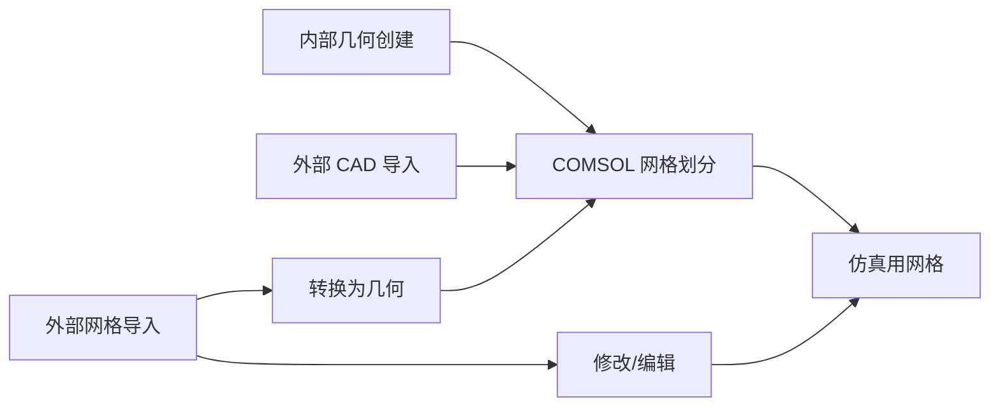

# 03 网格划分

> 📌 COMSOL 多物理场仿真基础强化培训 · 训练营3 · 167 分钟

---

## 一、网格基础

### 为什么需要网格？

网格是**有限元计算的基础**——将连续几何离散化为有限个单元，物理方程在这些离散单元上求解。

网格的两个作用：
1. **几何解析**：用离散单元逼近连续几何形状
2. **求解区域**：物理方程实际求解的位置

### 网格精度权衡

| | 细网格 | 粗网格 |
|------|------|------|
| 精度 | ✅ 高 | ❌ 低 |
| 计算量 | ❌ 大 | ✅ 小 |
| 几何解析 | ✅ 好 | ❌ 差（圆弧变折线） |

> 🎯 核心原则：**在精度与效率间取得平衡**

### 网格无关性验证

当对精度要求极高时：
1. 逐步细化网格
2. 计算每个细化程度的结果
3. 观察结果随网格数的收敛趋势
4. 结果稳定 → 已达到网格无关

---

## 二、COMSOL 网格创建途径

> 💡 COMSOL 支持几何与网格的灵活组合：内部创建 + 外部导入可混合使用。

---

## 三、单元类型

### 2D 面单元

| 类型 | 结构化程度 |
|------|-----------|
| 三角形 | 非结构化 |
| 四边形 | 结构化 |

### 3D 体单元

| 类型 | 形状 | 结构化程度 |
|------|------|-----------|
| 四面体 | 三角锥 | 非结构化 |
| 金字塔 | 四棱锥 | 过渡单元 |
| 棱柱 | 三棱柱 | 半结构化 |
| 六面体 | 立方体 | 结构化 |

---

## 四、物理场控制网格（自动）

### 特点
- 根据模型中已设置的物理场**自动适配**
- 自动选择类型、尺寸、区域
- 物理场设置改变 → 网格自动更新

### 示例：声学仿真
- 自动确定解析波长的单元尺寸
- PML 区 → 自动创建结构化网格（六面体/棱柱）
- PML 内侧 → 自动插入边界层
- 其余 → 四面体自由填充

### 9 级预定义尺寸
极细化 → 超细化 → 较细化 → 细化 → **常规** → 粗化 → 较粗化 → 超粗化 → 极粗化

---

## 五、用户控制网格（手动）

### 网格序列
与几何序列类似，从上到下顺序执行网格操作节点：
- 每个节点对应一种网格类型 + 操作区域
- 子节点控制尺寸、分布等

### 典型工作流
1. 物理场控制网格生成初始网格
2. 切换为**用户控制网格**
3. 在初始网格基础上修改/调整

---

## 六、网格尺寸控制参数

| 参数 | 作用 | 调整建议 |
|------|------|----------|
| **最大单元大小** | 单元尺寸上限 | 调小 → 整体细化 |
| **最小单元大小** | 单元尺寸下限（允许生成更小单元） | 有细小几何特征时调小 |
| **最大单元增长率** | 细→粗过渡的平滑度 | 调小 → 过渡更平滑但单元数更多 |
| **曲率因子** | 弯曲边界上的单元大小 = 曲率半径 × 因子 | 调小 → 曲面解析更精细 |
| **狭窄区域分辨率** | 狭窄区域的网格层数 | 调大 → 更多层 |

---

## 七、非结构化网格

### 3D
- **自由四面体网格**：自动填充任意形状区域
- 排列不规则，适应性强

### 2D / 面
- 自由三角形
- 自由四边形

---

## 八、结构化与半结构化网格

> 🎯 **优先使用结构化网格**（在可行的区域），以获得更好的质量和更少的单元数。

### 结构化网格优势
- 单元排列规则，**质量更高**
- 网格总数**更少**，计算更快
- 尺寸控制**更直接**（可按边指定层数）

### 映射（Mapped Mesh）— 2D 表面结构化网格

**条件：** 面形状规则（如矩形、扇形等）

**不规则形状的处理：**
1. 用**分割**添加辅助线
2. 将不规则面切成多个规则子面
3. 分别对各子面进行映射

> 📐 示例：正方形掏圆孔 → 四边中点连线到圆 → 四个扇形区域分别映射

**尺寸控制：**
- **大小**子节点：控制单元尺寸
- **分布**子节点：控制某条边上的单元层数

### 扫掠（Swept Mesh）— 3D 结构化网格

**原理：** 将源面的网格沿扫掠路径投射到目标面，路径上逐层生成。

**三要素：**
1. **源面**：已有网格的面
2. **目标面**：投射终点
3. **扫掠路径**：源→目标的几何路径

#### 源/目标面规则

- 源面区域数 **≥** 目标面区域数（只能多不能少）
- COMSOL 自动判断最佳源/目标分配
- 也可手动指定（但需满足上述规则）

#### 矩形印记自动处理

扫掠路径方向的侧面上有矩形印记时：
- 印记边 ∥ 或 ⟂ 扫掠方向 → **无需分割，自动处理**

#### 不满足扫掠条件时的处理

1. **虚拟几何操作**：隐藏阻碍特征
2. **分割**：将连接体切成多个满足扫掠条件的小区域
   - 用分割域 + 延伸面在交界处创建分割面
   - 逐个区域分别扫掠

#### 扫掠路径上的分布控制

| 类型 | 说明 |
|------|------|
| 固定单元数 | 指定层数 |
| 预定义 | 指定层数 + **单元大小比**（渐变） |
| 增长率 | 线性 / 指数增长 |
| 对称分布 | 从中部向两端对称渐变 |
| 反向 | 逆转变大方向 |

### 推荐工作流：先手动划分源面网格

1. 手动判断最佳源面
2. 对源面划分表面网格（自由三角形/自由四边形/映射）
3. 使用扫掠自动投射

> ✅ 好处：可对不同源面区域做**精细的差异化尺寸控制**。

---

## 九、混合网格与金字塔过渡

在一个模型中可**混用**结构化 + 非结构化网格：
- 不同区域设不同网格类型
- 过渡区域自动插入**金字塔单元**连接

> ⚠️ 注意：扫掠方向厚度过长 → 金字塔单元被拉长 → 质量变差。需适当细化扫掠路径。

### 网格可视化技巧

- 按**单元类型**着色（六面体/四面体/金字塔）
- **收缩单元**显示（间隙观察内部）
- 网格数据集 + 三维绘图组 → 自定义网格图

---

## 十、边界层网格

### 用途
在边界附近生成**分层加密网格**，用于解析边界层效应（如流体力学）。

### 维度

| 模型维度 | 边界层类型 |
|----------|-----------|
| 2D | 分层四边形网格 |
| 3D | 分层棱柱/六面体网格 |

### 控制参数

| 参数 | 作用 |
|------|------|
| **层数** | 边界层的层数 |
| **拉伸因子** | 每层厚度的递增比例 |
| **厚度调节因子** | 整体边界层厚度的缩放 |

### 操作要点
- 选择边界层依附的**边界**
- 选择边界层施加的**域**（可只在某一侧）
- 可对带边界层的面做扫掠 → 生成 3D 边界层

---

## 十一、复制网格与相同网格

### 复制网格（Copy Mesh）
- 将已有网格复制到另一几何体
- 适用于：周期性结构、阵列结构、旋转对称

**可复制层级：** 域 / 面 / 边

**示例：** 线圈阵列 → 先画一个线圈网格 → 复制到其余线圈

### 相同网格（Identical Mesh）
- **约束关系**：规定两个边界/边的网格始终保持一致
- 非直接创建网格，而是约束条件
- 用于周期性边界条件（结构力学循环对称、电磁 Floquet 边界等）
- 物理场控制网格会**自动考虑**相同网格约束

---

## 十二、网格质量评价

### 质量指标 ($0 \sim 1$)

| 质量值 | 含义 |
|--------|------|
| 1 | 理想单元（等边/等角） |
| → 0 | 越来越扭曲、细长 |

### 推荐阈值

| 模型 | 最低质量 |
|------|----------|
| 2D | > 0.3 |
| 3D | > 0.1 |

### 评价指标类型
偏度（Skewness）、最大角度、体积 vs 外接圆半径、体积与长度、条件数、增长率、弯曲偏度

### 网格统计
- 单元质量**直方图**（横轴：质量值；纵轴：单元数量）
- 期望：直方图**向右偏** → 多数单元质量好
- 可按单元类型分别查看

---

## 十三、网格可视化

| 功能 | 说明 |
|------|------|
| 按单元类型着色 | 区分四面体/六面体/金字塔/棱柱 |
| 按单元质量着色 | 直观显示质量差的区域 |
| 逻辑表达式过滤 | 仅显示满足条件的单元 |
| 收缩显示 | 单元间留间隙，便于观察内部 |
| 弯曲单元显示 | 解析曲面的单元显示为弯曲形态 |

---

## 十四、拓展功能

### 自适应网格细化
- 根据计算结果自动在变化剧烈区域细化网格

### 动网格与变形几何
- 模拟过程中网格随几何变形而更新

---

## 十五、网格划分最佳实践

1. **从粗到细**：先用物理场控制网格生成初始网格，再逐步细化
2. **优先结构化**：能用映射/扫掠的尽量用，质量好、数量少
3. **关键区域细化**：结果变化剧烈的区域手动加密
4. **避免细长单元**：各方向尺寸差异过大会降低质量
5. **检查网格统计**：确保最差质量高于阈值
6. **网格无关性验证**：对关键结果做收敛性检查

---

> 🔗 返回：[COMSOL 基础培训_总索引](COMSOL 基础培训_总索引) | 上一部分：[02 几何建模](02 几何建模)
