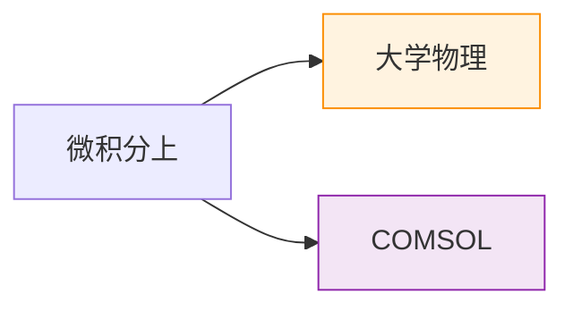

# 📖 课堂笔记

> 学科枢纽 — 11 门学科 · 128 篇笔记 · 覆盖大一全学年

---

## 🏫 学科总览

| 学科 | 笔记 | 学期 | 难度 | 
|:--|:--|:--|:--|
| 📐 [微积分上](微积分上/) | 31 | 大一上 | 入门→进阶 |
| 📐 [微积分下](微积分下/) | 16 | 大一下 | 进阶 |
| 🧮 [线性代数](线性代数/) | 19 | 大一下 | 入门→进阶 |
| ⚛️ [大学物理](大学物理/) | 14 | 大一下 | 入门 |
| 🧪 [有机化学](有机化学/) | 7 | 大一上 | 入门 |
| 🔧 [COMSOL 基础培训](COMSOL%20基础培训/) | 6 | 大一 | 入门 |
| 💻 [计算机科学](计算机科学/) | 4 | 大一 | 入门 |
| 📜 [中华民族发展史](中华民族发展史/) | 10 | 大一上 | — |
| 📜 [中国近代史](中国近代史/) | 10 | 大一下 | — |
| 🎖️ [军事理论](军事理论/) | 5 | 大一下 | — |
| 🏛️ [思政与社会](思政与社会/) | 2 | 大一 | — |

---

## 📐 数学类

- **[微积分上](微积分上/)**（31 篇）— 极限 → 导数 → 积分 → 微分方程
- **[微积分下](微积分下/)**（16 篇）— 多元微积分 → 重积分
- **[线性代数](线性代数/)**（19 篇）— 矩阵 → 行列式 → 向量空间 → 特征值

## 🔬 自然科学类

- **[大学物理](大学物理/)**（14 篇）— 力学 → 电磁学 → 相对论
- **[有机化学](有机化学/)**（7 篇）— 烷烃 → 不饱和烃 → 炔烃
- **[COMSOL 基础培训](COMSOL%20基础培训/)**（6 篇）— 建模 → 几何 → 网格

## 📚 人文社科类

- **[中华民族发展史](中华民族发展史/)**（10 篇）— 民族融合与中华文明
- **[中国近代史](中国近代史/)**（10 篇）— 近代中国的变革探索
- **[军事理论](军事理论/)**（5 篇）— 国防与强军思想
- **[思政与社会](思政与社会/)**（2 篇）— 宗教中国化调研
