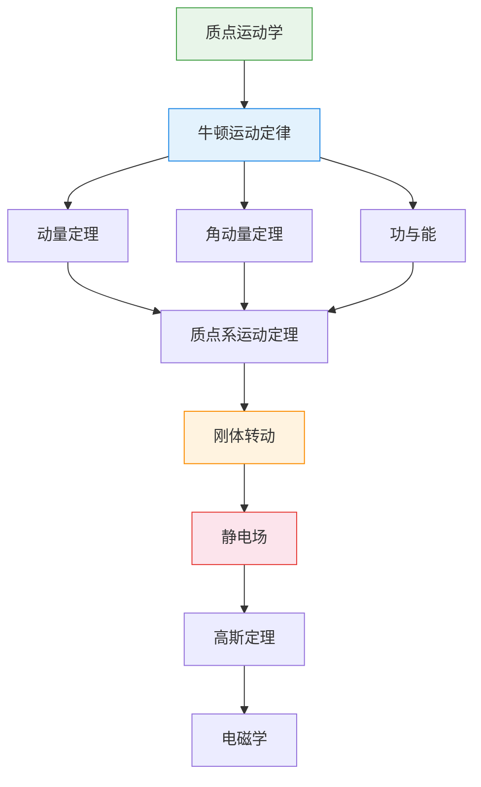

# ⚛️ 大学物理

> **学科**: 大学物理 | **学期**: 大一下 | **笔记**: 14 篇 | **难度**: 入门
>
> **前置课程**: 高中数学（三角、向量）、[微积分上](../微积分上/)（微分、积分）

---

## 🧭 概念关系图

---

## 📚 笔记目录

### 力学篇 入门

- [第一章 质点运动学](第一章_质点的运动)
- [第二章 质点的运动定理](第二章_质点的运动定理)
- [动量定理解析](动量定理解析)
- [角动量和质点系运动定理](角动量和质点系运动定理)
- [功与能](功与能)
- [质心与守恒律](质心与守恒律)
- [刚体转动定理](转动力学_定理)
- [转动力学总概](转动力学总概)
- [刚体转动_角动量](刚体转动_角动量)

### 电磁学篇 入门

- [真空中静电场](真空中静电场)
- [真空中的静电场](真空中的静电场)
- [高斯定理及其应用](高斯定理及其应用)
- [电磁学 期中备考](电磁学备考_II-1)

### 相对论基础 入门

- [相对论:洛伦兹变换](相对论_洛伦兹变换)

---

> 🔗 **后续课程**: 大学物理下（电磁学深入、光学、近代物理）
