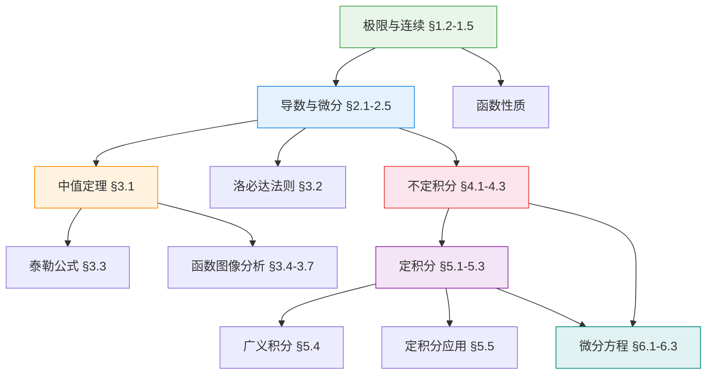

# 📐 微积分上

> **学科**: 微积分（理工） | **学期**: 大一上 | **笔记**: 31 篇 | **难度**: 入门 → 进阶
>
> **前置课程**: 高中数学（函数、三角、数列）

---

## 🧭 概念关系图

---

## 📚 笔记目录

### 第一章：极限与连续 入门

- [§1.2 数列的极限](微积分-§1.2 数列的极限) — ε-N 定义、收敛数列
- [§1.3 函数的极限](微积分-§1.3 函数的极限) — ε-δ 定义、左右极限
- [§1.4 无穷小量](微积分-§1.4 无穷小量) — 无穷小的阶、等价替换
- [§1.5 函数的连续性](微积分-§1.5 函数的连续性) — 连续与间断点

### 第二章：导数与微分 入门

- [§2.1-2.2 导数概念与求导法则](微积分-§2.1 导数概念与求导法则)
- [§2.3 高阶导数](微积分-§2.3 高阶导数)
- [§2.4 隐函数与参数方程确定的函数的导数](微积分-§2.4 隐函数与参数方程求导)
- [§2.5 函数的微分](微积分-§2.5 函数的微分)

### 第三章：中值定理与导数应用 进阶

- [§3.1 微分中值定理](微积分-§3.1 微分中值定理)
- [§3.2 洛必达法则](微积分-§3.2 洛必达法则)
- [§3.3 泰勒公式](微积分-§3.3 泰勒公式)
- [§3.4 函数的单调性与曲线的凹凸性](微积分-§3.4 函数的单调性与曲线的凹凸性)
- [§3.5 函数的渐近线和函数曲线](微积分-§3.5 函数的渐近线和函数曲线)
- [§3.6 极值与导数的应用](微积分-§3.6 极值与导数的应用)
- [§3.7 曲率](微积分-§3.7 曲率)

### 第四章：不定积分 入门

- [§4.1 不定积分的概念与性质](微积分-§4.1 不定积分的概念与性质)
- [§4.2(1) 第一类换元法（凑微分法）](微积分-§4.2(1) 第一类换元法)
- [§4.2(2) 第二类换元法](微积分-§4.2(2) 第二类换元法)
- [§4.2(3) 分部积分法](微积分-§4.2(3) 分部积分法)
- [§4.3 几种特殊函数的积分](微积分-§4.3 几种特殊函数的积分)

### 第五章：定积分 进阶

- [§5.1 定积分的基本概念](微积分-§5.1 定积分的基本概念)
- [§5.2 微积分基本公式](微积分-§5.2 微积分基本公式)
- [§5.3 定积分的积分法](微积分-§5.3 定积分的积分法)
- [§5.4 广义积分（反常积分）](微积分-§5.4 广义积分)
- [§5.5 定积分的应用](微积分-§5.5 定积分的应用)

### 第六章：微分方程 进阶

- [§6.1 微分方程的基本概念](微积分-§6.1 微分方程的基本概念)
- [§6.2 一阶微分方程](微积分-§6.2 一阶微分方程)
- [§6.3(1) 可降阶的二阶微分方程](微积分-§6.3(1) 可降阶的二阶微分方程)
- [§6.3(2) 二阶常系数齐次线性微分方程](微积分-§6.3(2) 二阶常系数齐次线性)
- [§6.3(3) 二阶线性微分方程解的性质与结构](微积分-§6.3(3) 解的性质与结构)
- [§6.3(4) 二阶常系数非齐次线性微分方程](微积分-§6.3(4) 非齐次与欧拉方程)
- [§9.1 二重积分的概念与性质](%C2%A79.1%20%E4%BA%8C%E9%87%8D%E7%A7%AF%E5%88%86%E7%9A%84%E6%A6%82%E5%BF%B5%E4%B8%8E%E6%80%A7%E8%B4%A8.md)

---

> 🔗 **后续课程**: [微积分下](../微积分下/)（多元微积分、重积分、无穷级数）
