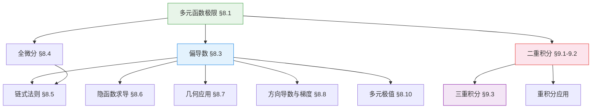

# 📐 微积分下

> **学科**: 微积分（理工） | **学期**: 大一下 | **笔记**: 16 篇 | **难度**: 进阶
>
> **前置课程**: [微积分上](../微积分上/)（极限、导数、一元微积分）

---

## 🧭 概念关系图

---

## 📚 笔记目录

### 第八章：多元函数微分学 入门

- [§8.1 多元函数的基本概念与极限](微积分-§8.1 多元函数的基本概念与极限)
- [微积分-§8.1(1) 多元函数的概念与极限](微积分-§8.1(1) 多元函数的概念与极限)
- [微积分-§8.1(2) 多元函数的极限与连续](微积分-§8.1(2) 多元函数的极限与连续)
- [§8.1（续）二元函数的极限方法与连续性](微积分-§8.1（续）极限方法与连续性)
- [微积分-§8.1(3) 偏导数与高阶导数](微积分-§8.1(3) 偏导数与高阶导数)
- [§8.3 偏导数与高阶偏导数](微积分-§8.3 偏导数与高阶偏导数)
- [§8.4 全微分](微积分-§8.4 全微分)
- [§8.5 多元复合函数求导法则（链式法则）](微积分-§8.5 多元复合函数求导法)
- [§8.6 隐函数的求导法则](微积分-§8.6 隐函数的求导法)
- [§8.7 偏导数在几何中的应用](微积分-§8.7 微分学在几何中的应用)
- [§8.8 方向导数与梯度](微积分-§8.8 方向导数与梯度)
- [§8.10 多元函数的极值与最值](微积分-§8.10 多元函数的极值与最值)

### 第九章：重积分 进阶

- [§9.1 二重积分的概念与性质](微积分-§9.1 二重积分的概念与性质)
- [§9.2 二重积分的计算法（一）— 直角坐标](微积分-§9.2(1) 直角坐标计算二重积分)
- [§9.2 二重积分的计算法（二）— 极坐标与坐标变换](微积分-§9.2(2) 极坐标计算二重积分)
- [§9.3 三重积分及其计算（一）— 直角坐标](微积分-§9.3 三重积分及其计算)

---

> 🔗 **前置课程**: [微积分上](../微积分上/)（极限、导数、一元积分）
