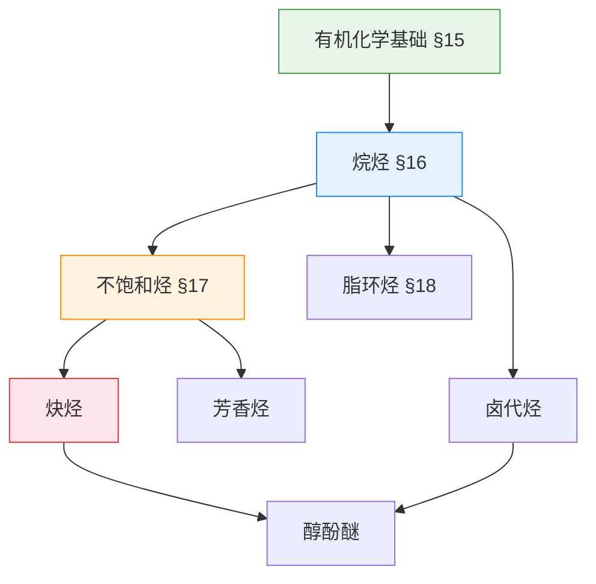

# 🧪 有机化学

> **学科**: 有机化学 | **学期**: 大一上 | **笔记**: 7 篇 | **难度**: 入门
>
> **前置课程**: 高中化学（原子结构、化学键）

---

## 🧭 概念关系图

---

## 📚 笔记目录

### 基础篇 入门

- [第十五章 有机化合物和有机化学](第十五章_有机化合物和有机化学) — 有机化学概论
- [第十六章 烷烃](第十六章_烷烃) — 命名、构象、反应
- [第十七章 不饱和烃](第十七章_不饱和烃) — 烯烃、炔烃、共轭二烯
- [第十八章 脂环烃](第十八章_脂环烃) — 环烷烃、构象分析

### 拓展阅读 进阶

- [炔烃自学读书报告](炔烃自学读书报告) — 深度自学笔记
- [obsidian-chem 多端部署指南](obsidian-chem部署指南) — 化学结构式渲染工具

---

> 🔗 **后续课程**: 有机化学下（芳香烃、醛酮、羧酸衍生物）
