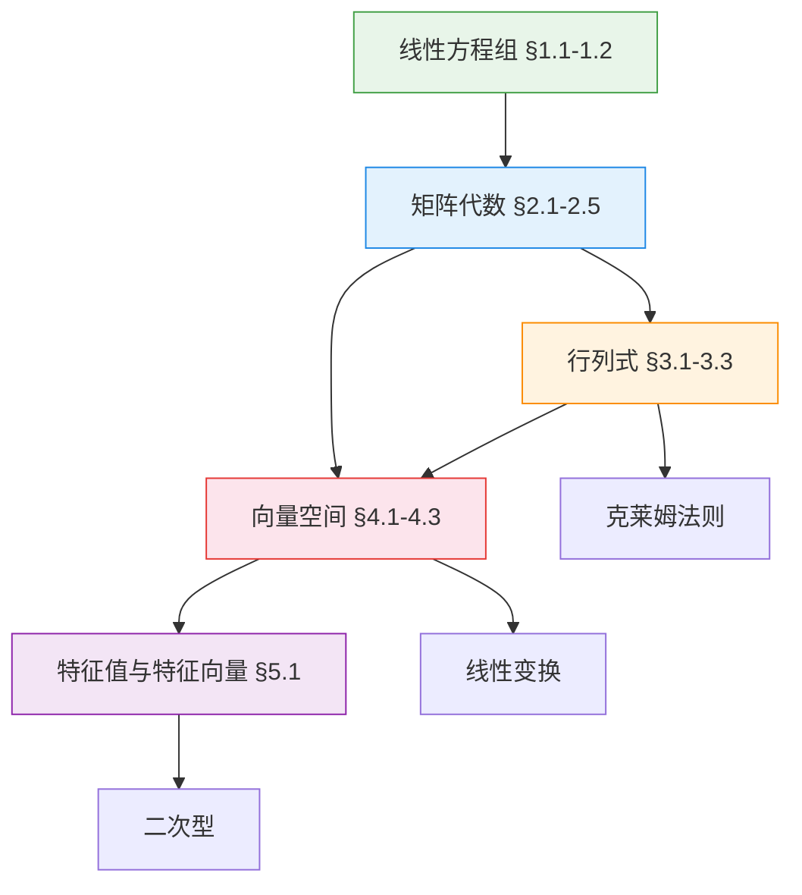

# 🧮 线性代数

> **学科**: 线性代数 | **学期**: 大一下 | **笔记**: 19 篇 | **难度**: 入门 → 进阶
>
> **前置课程**: 高中数学（向量、线性方程组）

---

## 🧭 概念关系图

---

## 📚 笔记目录

### 第一章：线性方程组 入门

- [1.1 线性方程组与高斯消元法](1.1_线性方程组、高斯消元法与矩阵)
- [1.2 行化简与阶梯形矩阵](1.2_行化简与阶梯形矩阵)
- [第一章 精简笔记](第一章_精简笔记)

### 第二章：矩阵代数 入门

- [2.1 & 2.2 矩阵的代数运算](2.1&2.2_矩阵的代数运算)
- [2.3 逆矩阵](2.3_逆矩阵)
- [2.4 转置矩阵与特殊方阵](2.4_转置矩阵与特殊方阵)
- [2.5 分块矩阵](2.5_分块矩阵)
- [第二章 精简笔记](第二章_精简笔记)

### 第三章：行列式 入门

- [3.1 方阵的行列式](3.1_方阵的行列式)
- [3.2 行列式的主要性质](3.2_行列式的主要性质)
- [3.3 行列式的应用](3.3_行列式的应用)
- [第三章 精简笔记](第三章_精简笔记)

### 第四章：向量空间 进阶

- [4.1 & 4.2 向量的线性相关与线性无关](4.1&4.2_向量的线性相关与线性无关)
- [4.3 向量组的极大无关组和秩](4.3_向量组的极大无关组和秩)

### 第五章：特征值与特征向量 进阶

- [5.1 特征值与特征向量](5.1_特征值与特征向量)

---

> 🔗 **后续延伸**: 矩阵论、数值分析、机器学习（PCA/SVD 依赖特征值分解）
