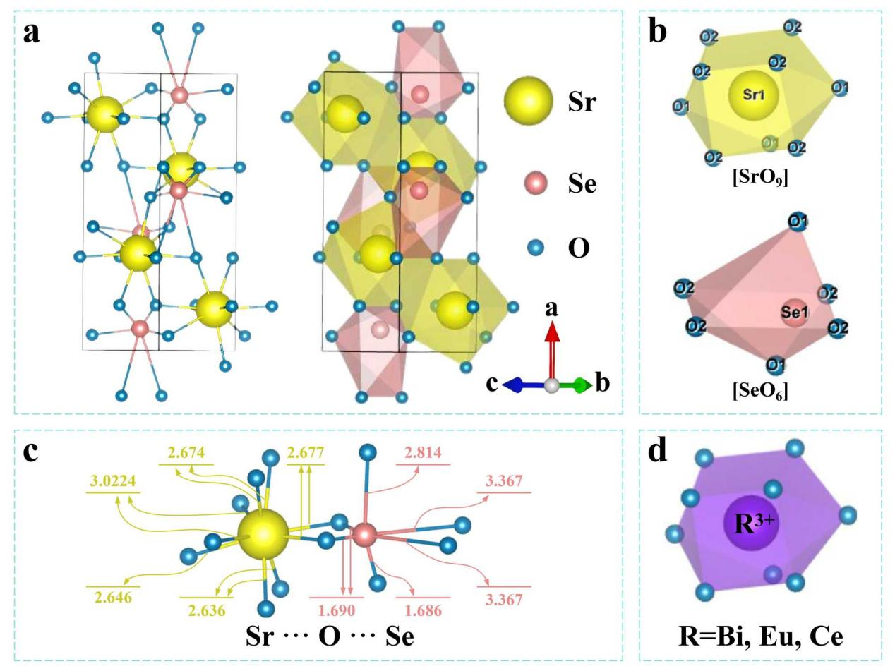
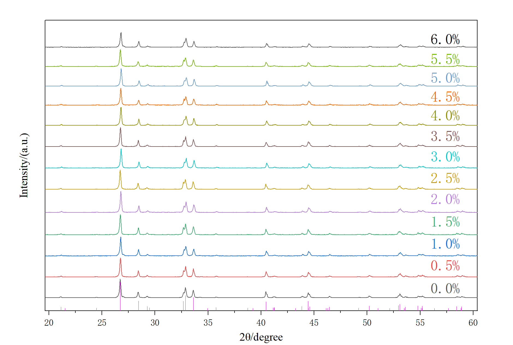
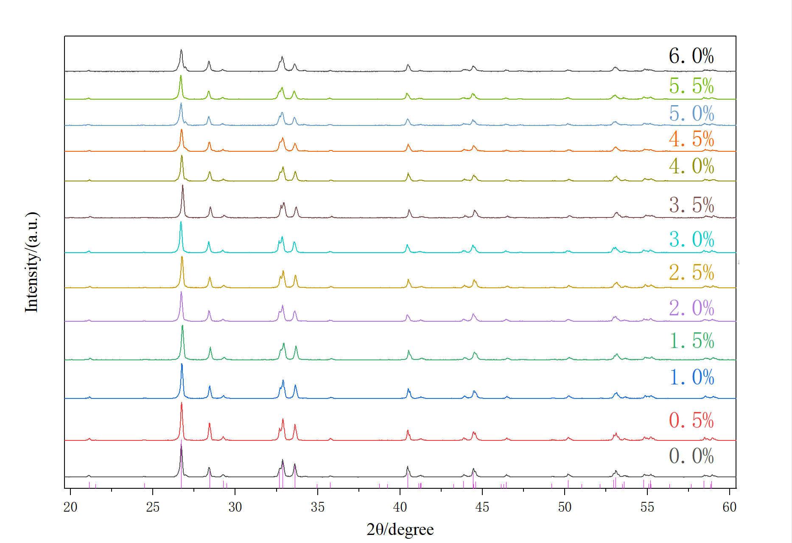

# SrSeO₃基质稀土离子掺杂发光晶体研究

## 摘要

本研究通过高温固相法成功制备了纯相SrSeO₃及SrSeO₃:0.5~6.0mol% R³⁺（R=Eu, Sm）掺杂体系，采用XRD分析证实所有样品为正交晶系（空间群Pnma），掺杂离子未引发杂相或晶相转变。通过文献查找可知SrSeO₃单质研究较少，但其作为基质材料在复合改性中展现潜力。该材料独特的[SrO₉]多面体可调控性及正交结构，使其成为新型发光、铁电及非线性光学器件的重要候选体系，未来可深入探索其功能特性与应用边界。

**关键词：** SrSeO₃；Eu³⁺；Sm³⁺；XRD图谱

## 选题原因

本人近期参加大创，其中需研究基于SrSeO₃基质三价Sm³⁺和Eu³⁺离子掺杂的发光晶体化合物，故选取该物质作为研究。

## 制备方法

采用**高温固相法**制备了SrSeO₃和SrSeO₃: 0.5~6.0mol% R³⁺ (R = Eu, Sm)样品。

所用化学原材料均为阿拉丁试剂(上海)有限公司所生产：
- SrCO₃ (99.995%)
- SeO₂ (99%)
- Sm₂O₃ (99.999%)
- Eu₂O₃ (99.999%)

**制备流程：**
1. 按化学计量比精确计量、研磨
2. 在玛瑙研钵中研磨30分钟
3. 放入高温箱式炉，950℃煅烧5小时
4. 自然冷却至室温，重新研磨得目标晶体材料

## 晶体结构

硒酸锶氧化物(SrSeO₃)是一种非常有趣的晶体化合物，均仅拥有一种Sr和Se阳离子格位，但具有分别对应P2₁/m (11)和Pnma (62)空间群结构的单斜晶系和正交晶系。

以正交晶系SrSeO₃晶体结构为例：
- **Sr格位**：与9个氧原子配位 → [SrO₉]十二面体
- **Se格位**：与6个氧原子配位 → [SeO₆]八面体
- [SrO₉]之间通过共享氧棱边相连，沿a轴呈螺旋状排列
- [SeO₆]和[SrO₉]通过共享氧棱边连接，呈链状螺旋结构 → 三维空间结构

**晶格常数：**

| 晶系 | a (Å) | b (Å) | c (Å) | 轴角 |
|------|-------|-------|-------|------|
| 单斜 | 4.456 | 5.478 | 6.574 | 90˚, 107.34˚, 90˚ |
| 正交 | 4.454 | 5.477 | 12.543 | — |

- Sr-O平均键长：2.5294 Å
- Se-O平均键长：2.48677 Å

正交相SrSeO₃的Sr格位与Se格位都严重偏离其所在的多面体中心。结合[HO₆]和[MO₉]多面体掺杂发光材料的研究，SrSeO₃可为多种掺杂离子提供合适的取代格位和晶体场环境，为实现相关掺杂离子的特征发射提供必要条件。

> 图1. (a) 基于SrSeO₃标准卡片(ICSD-419386)构建的晶体结构示意图，黄/红/蓝色球分别代表Sr/Se/O原子；(b) [SrO₉]十二面体与[SeO₆]八面体；(c) Sr与Se原子的连接方式及与O原子间的键长；(d) 掺杂离子R³⁺(R=Bi, Eu, Ce)的取代示意图

## 样品表征 (XRD)

样品的衍射峰均能与具有正交晶系的SrSeO₃标准卡片的峰位(ICSD-419386)相匹配。表明：

- ✅ 所合成样品为纯相
- ✅ 0.5~6.0mol%的Sm³⁺和Eu³⁺离子掺杂量未引起杂相或晶相转变

> 图2. 不同浓度Eu³⁺掺杂的SrSeO₃和ICSD-419386标准卡片的XRD衍射图谱

> 图3. 不同浓度Sm³⁺掺杂的SrSeO₃和ICSD-419386标准卡片的XRD衍射图谱

## 相关复合材料研究

SrSeO₃本身研究较少，更多以掺杂或复合材料形式出现：

1. **Sr₂Mn(SeO₃)₂Cl₂**：单斜晶系，P2₁/n，由边缘共享的SrO₆Cl₂多面体致密层构成，通过SeO₃三角锥连接的MnO₄Cl₂八面体孤立链分隔
2. **Sr₂Ni(SeO₃)₂Cl₂**：准一维自旋-1链系统，单斜晶系P2₁/n
3. **Sr(Sn,Se)O₃改性Bi₀.₅Na₀.₅TiO₃铁电陶瓷**：形成单相共存晶体结构

> 硒酸盐中的SeO₃三角锥结构对于形成特定晶体排列至关重要。

## 总结

SrSeO₃作为一种无机硒酸盐化合物，因其独特的晶体结构（正交晶系，空间群Pnma）和[SrO₉]多面体的可调控性，逐渐成为发光材料研究的热点。未来研究方向包括：晶体结构、铁电性、非线性光学及其他新兴功能材料领域。

## 参考文献

1. 李东升, 李泽楷, 郑栩, 等. 基于SrSeO₃基质三价Bi³⁺, Ce³⁺和Eu³⁺离子掺杂的发光晶体化合物的制备、结构与光致发光性能研究[J]. 光电子, 2025, 15(1): 11-21.
2. Lipp C, Schleid T. Orthorhombisches Sr[SeO₃][J]. Z. anorg. allg. Chem., 2008, 634(11): 2060.
3. Wildner M, Giester G. Crystal structures of SrSeO₃ and CaSeO₃ and their respective relationships with molybdomenite- and monazite-type compounds[J]. Neues Jahrbuch für Mineralogie, 2007, 184(1): 29-37.
4. Astakhov N V, et al. Strontium manganese selenite chloride Sr₂Mn(SeO₃)₂Cl₂[J]. J. Solid State Chem., 2025, 350: 125475.
5. Kozlyakova E S, et al. Quasi-1D XY antiferromagnet Sr₂Ni(SeO₃)₂Cl₂[J]. Scientific Reports, 2021, 11(1).
6. Arya B B, Samantray N P, Choudhary R N P. Sr(Sn,Se)O₃ modified Bi₀.₅K₀.₅TiO₃ ferroelectric ceramics[J]. Applied Physics A, 2022, 129(1).
