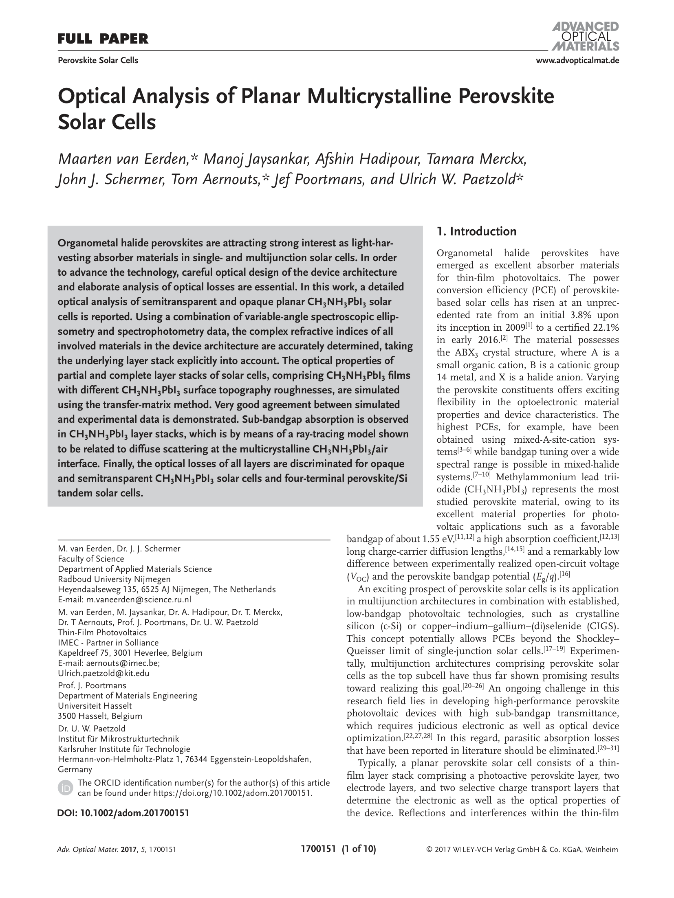
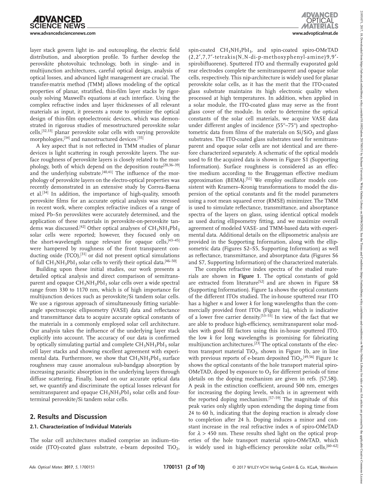
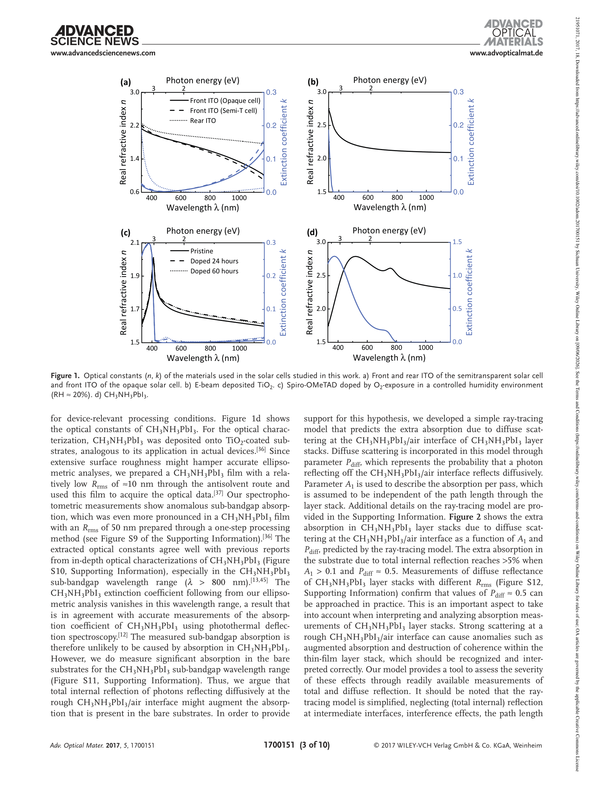
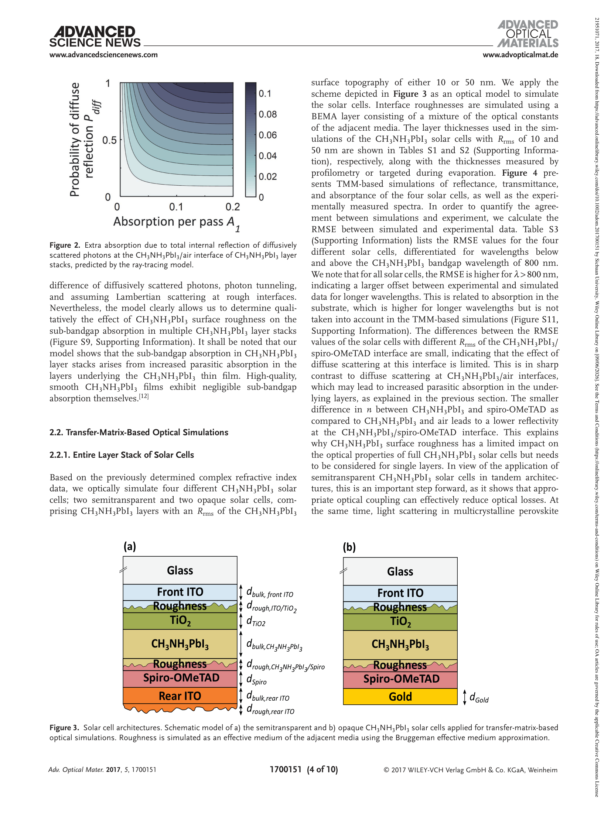
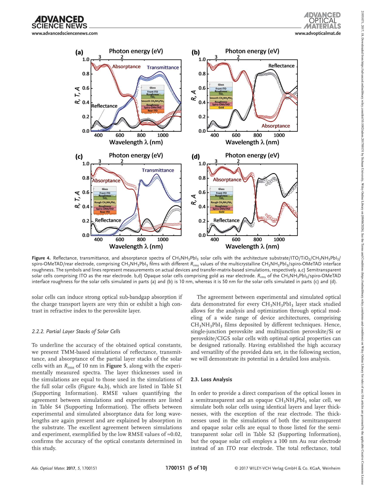
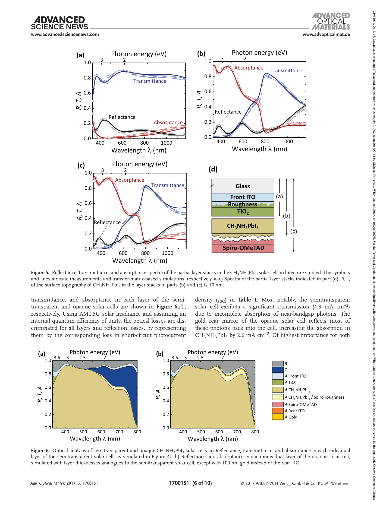
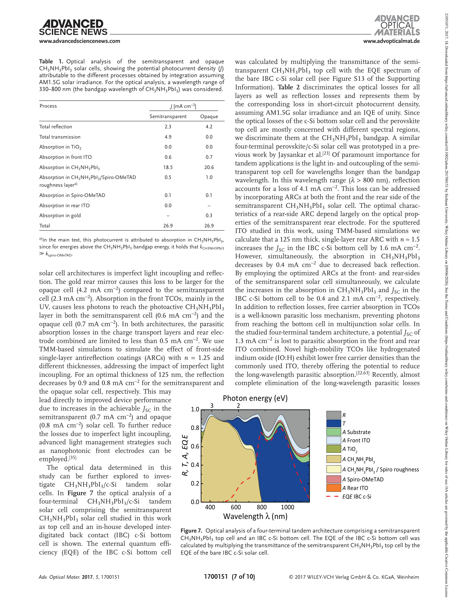
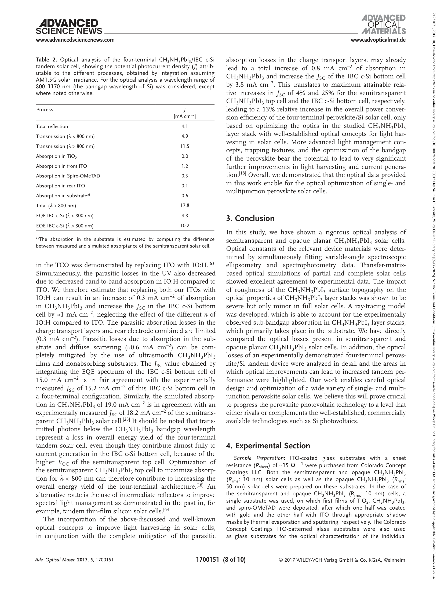
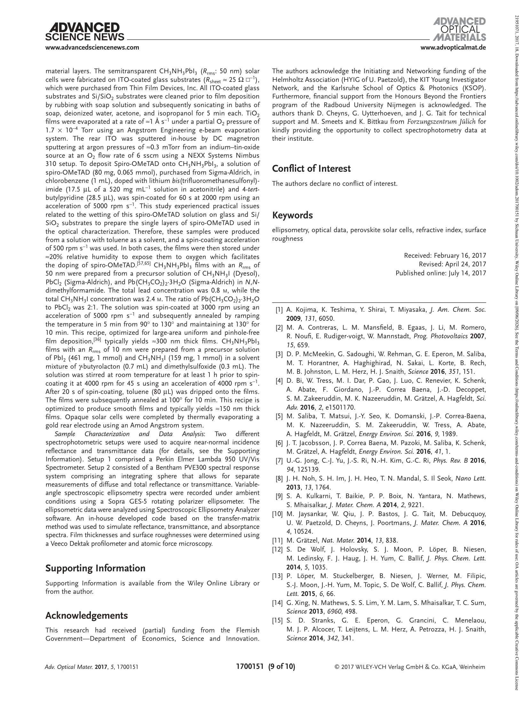
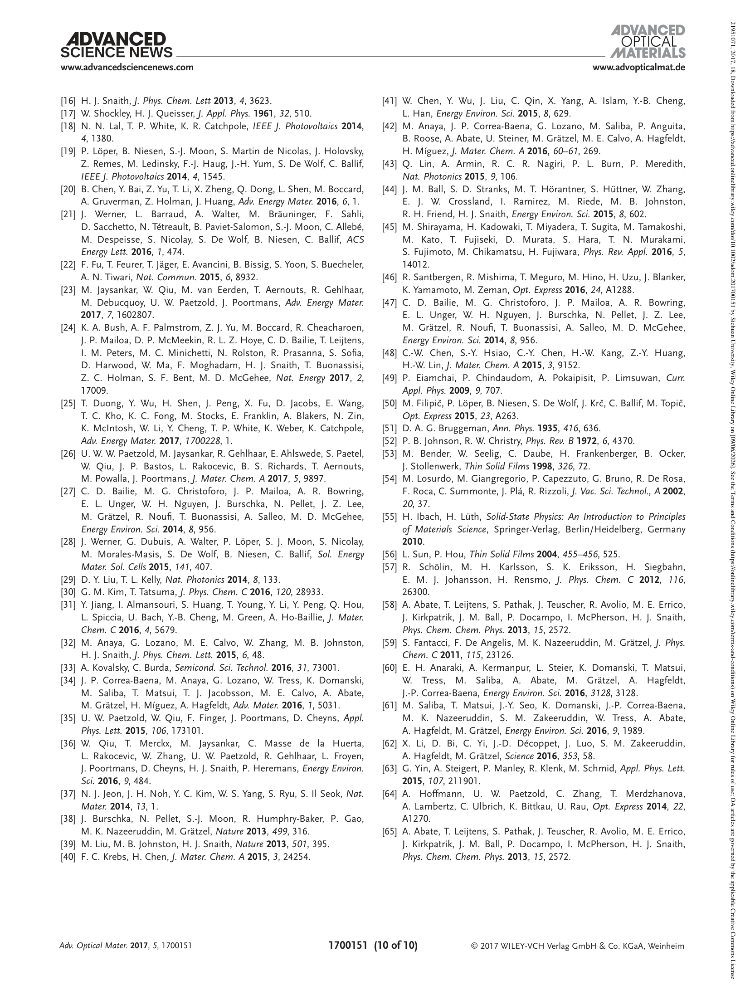

  Optical Analysis of Planar Multicrystalline Perovskite Solar Cells
  ✍ Maarten van Eerden, Manoj Jaysankar, Afshin Hadipour, Tamara Merckx, John J. Schermer, Tom Aernouts, Jef Poortmans, Ulrich W. Paetzold
  📄 Advanced Optical Materials · 2017 · Vol.5, 1700151
  📎 DOI: 10.1002/adom.201700151
  

    钙钛矿
    光学分析
    转移矩阵法
    多晶
    椭偏仪
  

> [!abstract] 摘要
> 本研究对半透明和不透明平面 CH₃NH₃PbI₃ 钙钛矿太阳能电池进行了详细的光学分析。通过结合**变角度光谱椭偏仪（VASE）** 和分光光度法数据，精确测定了器件架构中所有材料的复折射率（n & k），并利用**转移矩阵法（TMM）** 模拟了不同表面形貌粗糙度的完整层叠光学性质。实验与模拟数据之间展示了非常好的吻合。研究还观察到 CH₃NH₃PbI₃ 层叠中的亚带隙吸收，通过光线追踪模型证明这与多晶钙钛矿/空气界面的漫散射有关。最后，对不透明和半透明太阳能电池以及四端钙钛矿/Si 叠层太阳能电池的所有层的光学损耗进行了区分和量化。
>
> **关键词：** 钙钛矿太阳能电池 · 光学分析 · 转移矩阵法 · 椭偏仪 · 多晶

---

> [!key-finding] 核心发现
> 
> **1. 精确光学常数测定** — 首次同时拟合 VASE 和分光光度数据，获得 CH₃NH₃PbI₃、spiro-OMeTAD、TiO₂ 和多种 ITO 的完整 n & k 光谱（330–1170 nm）。
>
> **2. 钙钛矿表面粗糙度效应** — 多晶钙钛矿/空气界面的漫散射会导致亚带隙区域（>800 nm）出现异常"伪吸收"（最高 >5%），实际源于基底层的寄生吸收增强。但在完整器件中此效应有限。
>
> **3. 光学损耗定量区分** — 半透明器件中，反射损耗 2.3 mA/cm²、透射损耗 4.9 mA/cm²、前 ITO 寄生吸收 0.6 mA/cm²；通过引入 125 nm 单层增透膜（n=1.25）可回收 0.7–0.8 mA/cm²。
>
> **4. 叠层器件优化路径** — 四端钙钛矿/Si 叠层中，仅通过光学优化即可提升 PCE 约 13%；更换 ITO 为高迁移率 IO:H 可额外回收约 1 mA/cm²。

---

## 📖 论文全文（渲染页）

> **注：** 此 PDF 为双栏排版的期刊论文，文字自动提取质量不佳。以下为200 DPI渲染的原始页面，可直接阅读。

