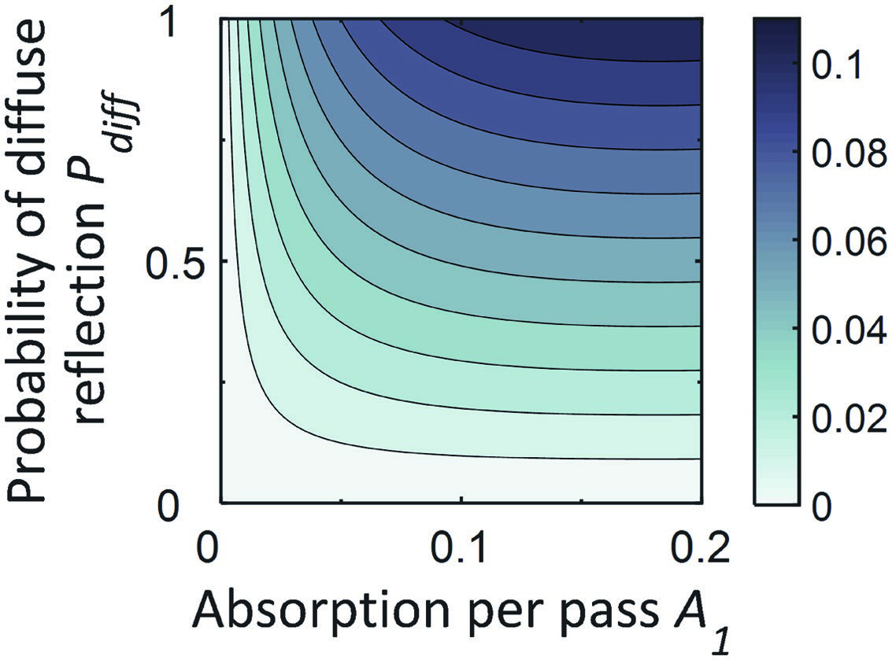
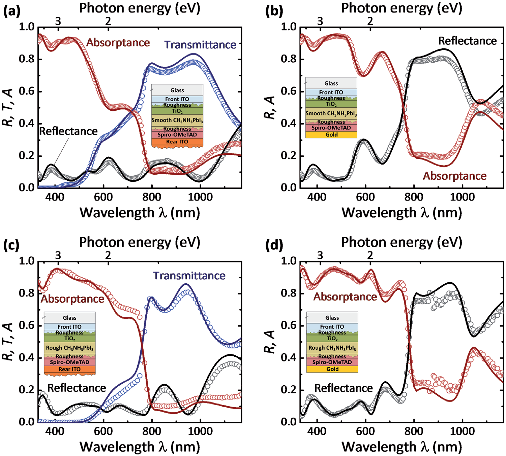
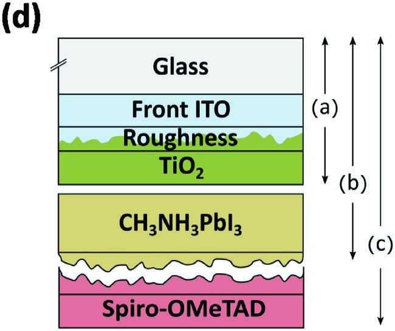

  Optical Analysis of Planar Multicrystalline Perovskite Solar Cells
  ✍ Maarten van Eerden, Manoj Jaysankar, Afshin Hadipour, Tamara Merckx, John J. Schermer, Tom Aernouts, Jef Poortmans, Ulrich W. Paetzold
  📄 Advanced Optical Materials · 2017 · Vol.5, 1700151
  📎 DOI: 10.1002/adom.201700151
  

    钙钛矿
    光学分析
    转移矩阵法
    多晶
    椭偏仪
  

> [!abstract] 摘要
> 本研究对半透明和不透明平面 CH₃NH₃PbI₃ 太阳能电池进行了详细的光学分析。通过结合变角度光谱椭偏仪（VASE）和分光光度法数据，精确测定了器件架构中所有材料的复折射率。利用转移矩阵法（TMM）模拟了不同 CH₃NH₃PbI₃ 表面形貌粗糙度的部分和完整层叠的光学性质。实验与模拟数据之间展示了非常好的吻合。观察到 CH₃NH₃PbI₃ 层叠中的亚带隙吸收，通过光线追踪模型证明这与多晶 CH₃NH₃PbI₃/空气界面的漫散射有关。最后，对不透明和半透明 CH₃NH₃PbI₃ 太阳能电池及四端钙钛矿/Si 叠层太阳能电池的所有层的光学损耗进行了区分。
>
> **关键词：** 钙钛矿太阳能电池 · 光学分析 · 转移矩阵法 · 椭偏仪 · 多晶

# Optical Analysis of Planar Multicrystalline Perovskite Solar Cells
Optical Analysis of Planar Multicrystalline Perovskite
Solar Cells
Maarten van Eerden,* Manoj Jaysankar, Afshin Hadipour, Tamara Merckx,
John J. Schermer, Tom Aernouts,* Jef Poortmans, and Ulrich W. Paetzold*
1. Introduction
Organometal halide perovskites are attracting strong interest as light-harOrganometal halide perovskites have
vesting absorber materials in single- and multijunction solar cells. In order
emerged as excellent absorber materials
to advance the technology, careful optical design of the device architecture
for thin-film photovoltaics. The power
and elaborate analysis of optical losses are essential. In this work, a detailed conversion efficiency (PCE) of perovskiteoptical analysis of semitransparent and opaque planar CH NH PbI solar based solar cells has risen at an unprec3 3 3
cells is reported. Using a combination of variable-angle spectroscopic ellip- edented rate from an initial 3.8% upon
its inception in 2009[1] to a certified 22.1%
sometry and spectrophotometry data, the complex refractive indices of all
in early 2016.[2] The material possesses
involved materials in the device architecture are accurately determined, taking
the ABX crystal structure, where A is a
3
the underlying layer stack explicitly into account. The optical properties of
small organic cation, B is a cationic group
partial and complete layer stacks of solar cells, comprising CH 3 NH 3 PbI 3 films 14 metal, and X is a halide anion. Varying
with different CH NH PbI surface topography roughnesses, are simulated the perovskite constituents offers exciting
3 3 3
using the transfer-matrix method. Very good agreement between simulated flexibility in the optoelectronic material
properties and device characteristics. The
and experimental data is demonstrated. Sub-bandgap absorption is observed
highest PCEs, for example, have been
in CH NH PbI layer stacks, which is by means of a ray-tracing model shown
3 3 3 obtained using mixed-A-site-cation systo be related to diffuse scattering at the multicrystalline CH 3 NH 3 PbI 3 /air tems[3–6] while bandgap tuning over a wide
interface. Finally, the optical losses of all layers are discriminated for opaque spectral range is possible in mixed-halide
and semitransparent CH NH PbI solar cells and four-terminal perovskite/Si systems.[7–10] Methylammonium lead trii3 3 3
odide (CH NH PbI ) represents the most
tandem solar cells. 3 3 3
studied perovskite material, owing to its
excellent material properties for photovoltaic applications such as a favorable
bandgap of about 1.55 eV,[11,12] a high absorption coefficient,[12,13]
M. van Eerden, Dr. J. J. Schermer long charge-carrier diffusion lengths,[14,15] and a remarkably low
Faculty of Science
difference between experimentally realized open-circuit voltage
Department of Applied Materials Science
(V ) and the perovskite bandgap potential (E /q).[16]
Radboud University Nijmegen OC g
Heyendaalseweg 135, 6525 AJ Nijmegen, The Netherlands An exciting prospect of perovskite solar cells is its application
E-mail: m.vaneerden@science.ru.nl in multijunction architectures in combination with established,
M. van Eerden, M. Jaysankar, Dr. A. Hadipour, Dr. T. Merckx, low-bandgap photovoltaic technologies, such as crystalline
Dr. T Aernouts, Prof. J. Poortmans, Dr. U. W. Paetzold silicon (c-Si) or copper–indium–gallium–(di)selenide (CIGS).
Thin-Film Photovoltaics
This concept potentially allows PCEs beyond the Shockley–
IMEC - Partner in Solliance
Kapeldreef 75, 3001 Heverlee, Belgium Queisser limit of single-junction solar cells.[17–19] ExperimenE-mail: aernouts@imec.be; tally, multijunction architectures comprising perovskite solar
Ulrich.paetzold@kit.edu cells as the top subcell have thus far shown promising results
Prof. J. Poortmans toward realizing this goal.[20–26] An ongoing challenge in this
Department of Materials Engineering
research field lies in developing high-performance perovskite
Universiteit Hasselt
photovoltaic devices with high sub-bandgap transmittance,
3500 Hasselt, Belgium
which requires judicious electronic as well as optical device
Dr. U. W. Paetzold
Institut für Mikrostrukturtechnik optimization.[22,27,28] In this regard, parasitic absorption losses
Karlsruher Institute für Technologie that have been reported in literature should be eliminated.[29–31]
Hermann-von-Helmholtz-Platz 1, 76344 Eggenstein-Leopoldshafen, Typically, a planar perovskite solar cell consists of a thinGermany
film layer stack comprising a photoactive perovskite layer, two
The ORCID identification number(s) for the author(s) of this article
electrode layers, and two selective charge transport layers that
can be found under https://doi.org/10.1002/adom.201700151.
determine the electronic as well as the optical properties of
DOI: 10.1002/adom.201700151 the device. Reflections and interferences within the thin-film

www.advancedsciencenews.com www.advopticalmat.de
layer stack govern light in- and outcoupling, the electric field spin-coated CH NH PbI , and spin-coated spiro-OMeTAD
3 3 3
distribution, and absorption profile. To further develop the (2,2′,7,7′-tetrakis(N,N-di-p-methoxyphenyl-amine)9,9′perovskite photovoltaic technology, both in single- and in spirobifluorene). Sputtered ITO and thermally evaporated gold
multijunction architectures, careful optical design, analysis of rear electrodes complete the semitransparent and opaque solar
optical losses, and advanced light management are crucial. The cells, respectively. This nip-architecture is widely used for planar
transfer-matrix method (TMM) allows modeling of the optical perovskite solar cells, as it has the merit that the ITO-coated
properties of planar, stratified, thin-film layer stacks by rigor- glass substrate maintains its high electronic quality when
ously solving Maxwell’s equations at each interface. Using the processed at high temperatures. In addition, when applied in
complex refractive index and layer thicknesses of all relevant a solar module, the ITO-coated glass may serve as the front
materials as input, it presents a route to optimize the optical glass cover of the module. In order to determine the optical
design of thin-film optoelectronic devices, which was demon- constants of the solar cell materials, we acquire VASE data
strated in rigorous studies of mesostructured perovskite solar under different angles of incidence (55°–75°) and spectrophocells,[32,33] planar perovskite solar cells with varying perovskite tometric data from films of the materials on Si/SiO and glass
2
morphologies,[34] and nanostructured devices.[35] substrates. The ITO-coated glass substrates used for semitransA key aspect that is not reflected in TMM studies of planar parent and opaque solar cells are not identical and are theredevices is light scattering in rough perovskite layers. The sur- fore characterized separately. A schematic of the optical models
face roughness of perovskite layers is closely related to the mor- used to fit the acquired data is shown in Figure S1 (Supporting
phology, both of which depend on the deposition route[20,36–39] Information). Surface roughness is considered as an effecand the underlying substrate.[40,41] The influence of the mor- tive medium according to the Bruggeman effective medium
phology of perovskite layers on the electro-optical properties was approximation (BEMA).[51] We employ oscillator models conrecently demonstrated in an extensive study by Correa-Baena sistent with Kramers–Kronig transformations to model the diset al.[34] In addition, the importance of high-quality, smooth persion of the optical constants and fit the model parameters
perovskite films for an accurate optical analysis was stressed using a root mean squared error (RMSE) minimizer. The TMM
in recent work, where complex refractive indices of a range of is used to simulate reflectance, transmittance, and absorptance
mixed Pb–Sn perovskites were accurately determined, and the spectra of the layers on glass, using identical optical models
application of these materials in perovskite-on-perovskite tan- as used during ellipsometry fitting, and we maximize overall
dems was discussed.[42] Other optical analyses of CH NH PbI agreement of modeled VASE- and TMM-based data with experi3 3 3
solar cells were reported; however, they focused only on mental data. Additional details on the ellipsometric analysis are
the short-wavelength range relevant for opaque cells,[43–45] provided in the Supporting Information, along with the ellipwere hampered by roughness of the front transparent con- sometric data (Figures S2–S5, Supporting Information) as well
ducting oxide (TCO),[31] or did not present optical simulations as reflectance, transmittance, and absorptance data (Figures S6
of full CH NH PbI solar cells to verify their optical data.[46–50] and S7, Supporting Information) of the characterized materials.
3 3 3
Building upon these initial studies, our work presents a The complex refractive index spectra of the studied matedetailed optical analysis and direct comparison of semitrans- rials are shown in Figure 1. The optical constants of gold
parent and opaque CH NH PbI solar cells over a wide spectral are extracted from literature[52] and are shown in Figure S8
3 3 3
range from 330 to 1170 nm, which is of high importance for (Supporting Information). Figure 1a shows the optical constants
multijunction devices such as perovskite/Si tandem solar cells. of the different ITOs studied. The in-house sputtered rear ITO
We use a rigorous approach of simultaneously fitting variable- has a higher n and lower k for long wavelengths than the comangle spectroscopic ellipsometry (VASE) data and reflectance mercially provided front ITOs (Figure 1a), which is indicative
and transmittance data to acquire accurate optical constants of of a lower free carrier density.[53–55] In view of the fact that we
the materials in a commonly employed solar cell architecture. are able to produce high-efficiency, semitransparent solar modOur analysis takes the influence of the underlying layer stack ules with good fill factors using this in-house sputtered ITO,
explicitly into account. The accuracy of our data is confirmed the low k for long wavelengths is promising for fabricating
by optically simulating partial and complete CH NH PbI solar multijunction architectures.[23] The optical constants of the elec3 3 3
cell layer stacks and showing excellent agreement with experi- tron transport material TiO , shown in Figure 1b, are in line
2
mental data. Furthermore, we show that CH NH PbI surface with previous reports of e-beam deposited TiO .[49,56] Figure 1c
3 3 3 2
roughness may cause anomalous sub-bandgap absorption by shows the optical constants of the hole transport material spiroincreasing parasitic absorption in the underlying layers through OMeTAD, doped by exposure to O for different periods of time
2
diffuse scattering. Finally, based on our accurate optical data (details on the doping mechanism are given in refs. [57,58]).
set, we quantify and discriminate the optical losses relevant for A peak in the extinction coefficient, around 500 nm, emerges
semitransparent and opaque CH NH PbI solar cells and four- for increasing the doping levels, which is in agreement with
3 3 3
terminal perovskite/Si tandem solar cells. the reported doping mechanism.[57–59] The magnitude of this
peak varies only slightly upon extending the doping time from
24 to 60 h, indicating that the doping reaction is already close
2. Results and Discussion
to completion after 24 h. Doping induces a minor and con2.1. Characterization of Individual Materials stant increase in the real refractive index n of spiro-OMeTAD
for λ > 450 nm. These results shed light on the optical propThe solar cell architectures studied comprise an indium–tin- erties of the hole transport material spiro-OMeTAD, which
oxide (ITO)-coated glass substrate, e-beam deposited TiO , is widely used in high-efficiency perovskite solar cells,[60–62]
2
21951071,
2017,
18,
Commons
License

www.advancedsciencenews.com www.advopticalmat.de
|     | Photon energy (eV) |     |     |     | Photon energy (eV) |     |     |
| (a) |                    |     |     | (b) |                    |     |     |
|     | 3                  | 2   |     | 3   | 2                  |     |     |
|     | 3.0                |     | 0.3 | 3.0 |                    | 0.3 |     |
n xedni evitcarfer laeR  Front ITO (Opaque cell) k tneiciffeoc noitcnitxE n xedni evitcarfer laeR k tneiciffeoc noitcnitxE
Front ITO (Semi-T cell)
|     | 2.2               |  Rear ITO |      | 2.5 |                   |     |     |
|     |                   |           | 0.2  |     |                   | 0.2 |     |
|     | 1.4               |           | 0.1  | 2.0 |                   | 0.1 |     |
|     | 0.6               |           | 0.0  | 1.5 |                   | 0.0 |     |
|     | 400               | 600 800   | 1000 | 400 | 600 800 1000      |     |     |
|     | Wavelength λ (nm) |           |      |     | Wavelength λ (nm) |     |     |
Photon energy (eV)
| (c) | Photon energy (eV) |     |     | (d) |     |     |     |
|     | 3                  | 2   |     | 3   | 2   |     |     |
|     | 2.1                |     | 0.3 | 3.0 |     | 1.5 |     |
n xedni evitcarfer laeR  Pristine k tneiciffeoc noitcnitxE n xedni evitcarfer laeR k tneiciffeoc noitcnitxE
Doped 24 hours
Doped 60 hours
|     | 1.9               |         | 0.2  | 2.5 |                   | 1.0 |     |
|     | 1.7               |         | 0.1  | 2.0 |                   | 0.5 |     |
|     | 1.5               |         | 0.0  | 1.5 |                   | 0.0 |     |
|     | 400               | 600 800 | 1000 | 400 | 600 800 1000      |     |     |
|     | Wavelength λ (nm) |         |      |     | Wavelength λ (nm) |     |     |
Figure 1. Optical constants (n, k) of the materials used in the solar cells studied in this work. a) Front and rear ITO of the semitransparent solar cell
and front ITO of the opaque solar cell. b) E-beam deposited TiO. c) Spiro-OMeTAD doped by O-exposure in a controlled humidity environment
|     |     |     | 2   |     | 2   |     |     |
(RH ≈ 20%). d) CHNHPbI. 3 3 3
for  device-relevant  processing  conditions.  Figure  1d  shows  support for this hypothesis, we developed a simple ray-tracing
the optical constants of CH 3 NH 3 PbI 3 . For the optical charac- model that predicts the extra absorption due to diffuse scatterization, CH NH PbI  was deposited onto TiO -coated sub- tering at the CH NH PbI /air interface of CH NH PbI  layer
| 3 3 | 3   |     | 2   |     | 3 3 3 | 3 3 | 3   |
strates, analogous to its application in actual devices.[36] Since  stacks. Diffuse scattering is incorporated in this model through
extensive surface roughness might hamper accurate ellipso- parameter P , which represents the probability that a photon
diff
metric analyses, we prepared a CH 3 NH 3 PbI 3  film with a rela- reflecting off the CH 3 NH 3 PbI 3 /air interface reflects diffusively.
tively low R rms  of ≈10 nm through the antisolvent route and  Parameter A 1  is used to describe the absorption per pass, which
used this film to acquire the optical data.[37] Our spectropho- is assumed to be independent of the path length through the
tometric measurements show anomalous sub-bandgap absorp- layer stack. Additional details on the ray-tracing model are protion, which was even more pronounced in a CH NH PbI  film  vided in the Supporting Information. Figure 2 shows the extra
3 3 3
with an R rms  of 50 nm prepared through a one-step processing  absorption in CH 3 NH 3 PbI 3  layer stacks due to diffuse scatmethod (see Figure S9 of the Supporting Information).[36] The
|     |     |     |     | tering at the CH | 3 NH 3 PbI 3 /air interface as a function of A |     | 1  and  |
extracted optical constants agree well with previous reports  P , predicted by the ray-tracing model. The extra absorption in
diff
from in-depth optical characterizations of CH NH PbI  (Figure  the substrate due to total internal reflection reaches >5% when
|     |     |     | 3 3 3 |     |     |     |     |
S10, Supporting Information), especially in the CH NH PbI   A  > 0.1 and P  ≈ 0.5. Measurements of diffuse reflectance
|     |     |     | 3 3 | 3 1 | diff |     |     |
nm).[13,45]
sub-bandgap  wavelength  range  (λ  >  800  The  of CH 3 NH 3 PbI 3  layer stacks with different R rms  (Figure S12,
CH 3 NH 3 PbI 3  extinction coefficient following from our ellipso- Supporting Information) confirm that values of P diff  ≈ 0.5 can
metric analysis vanishes in this wavelength range, a result that  be approached in practice. This is an important aspect to take
is in agreement with accurate measurements of the absorp- into account when interpreting and analyzing absorption meastion coefficient of CH NH PbI  using photothermal deflec- urements of CH NH PbI  layer stacks. Strong scattering at a
|     | 3 3 | 3   |     |     | 3 3 3 |     |     |
tion spectroscopy.[12] The measured sub-bandgap absorption is
|     |     |     |     | rough CH 3 | NH 3 PbI 3 /air interface can cause anomalies such as  |     |     |
therefore unlikely to be caused by absorption in CH 3 NH 3 PbI 3 .  augmented absorption and destruction of coherence within the
However, we do measure significant absorption in the bare  thin-film layer stack, which should be recognized and intersubstrates for the CH NH PbI  sub-bandgap wavelength range  preted correctly. Our model provides a tool to assess the severity
|     | 3 3 3 |     |     |     |     |     |     |
(Figure S11, Supporting Information). Thus, we argue that  of  these  effects  through  readily  available  measurements  of
total internal reflection of photons reflecting diffusively at the  total and diffuse reflection. It should be noted that the rayrough CH 3 NH 3 PbI 3 /air interface might augment the absorp- tracing model is simplified, neglecting (total internal) reflection
tion that is present in the bare substrates. In order to provide  at intermediate interfaces, interference effects, the path length
1700151 (3 of 10)

www.advancedsciencenews.com www.advopticalmat.de
|     |     |     |     | surface  | topography  | of  either  | 10  or  50  nm.  | We  | apply  the  |
scheme depicted in Figure 3 as an optical model to simulate
the solar cells. Interface roughnesses are simulated using a
BEMA layer consisting of a mixture of the optical constants
of the adjacent media. The layer thicknesses used in the sim|     |     |     |     | ulations of the CH |     | NH PbI  solar cells with R |     |  of 10 and  |     |
|     |     |     |     |                    |     | 3 3 3                      |     | rms         |     |
50 nm are shown in Tables S1 and S2 (Supporting Information), respectively, along with the thicknesses measured by
|     |     |     |     | profilometry  | or  targeted  | during  | evaporation.  | Figure  | 4  pre- |
sents TMM-based simulations of reflectance, transmittance,
and absorptance of the four solar cells, as well as the experimentally measured spectra. In order to quantify the agreement between simulations and experiment, we calculate the
RMSE between simulated and experimental data. Table S3
(Supporting Information) lists the RMSE values for the four
Figure 2. Extra absorption due to total internal reflection of diffusively
|     |     |     |     | different  | solar  cells,  | differentiated  | for  wavelengths  |     | below  |
scattered photons at the CHNHPbI/air interface of CHNHPbI layer
|     | 3 3 | 3   | 3 3 3 |     |     |     |     |     |     |
stacks, predicted by the ray-tracing model. and above the CH 3 NH 3 PbI 3  bandgap wavelength of 800 nm.
We note that for all solar cells, the RMSE is higher for λ > 800 nm,
difference of diffusively scattered photons, photon tunneling,  indicating a larger offset between experimental and simulated
and  assuming  Lambertian  scattering  at  rough  interfaces.  data for longer wavelengths. This is related to absorption in the
Nevertheless, the model clearly allows us to determine quali- substrate, which is higher for longer wavelengths but is not
tatively the effect of CH 3 NH 3 PbI 3  surface roughness on the  taken into account in the TMM-based simulations (Figure S11,
sub-bandgap absorption in multiple CH 3 NH 3 PbI 3  layer stacks  Supporting Information). The differences between the RMSE
(Figure S9, Supporting Information). It shall be noted that our  values of the solar cells with different R  of the CH NH PbI /
|     |     |     |     |     |     |     | rms |     | 3 3 3 |
model shows that the sub-bandgap absorption in CH NH PbI   spiro-OMeTAD interface are small, indicating that the effect of
|     |     |     | 3 3 | 3   |     |     |     |     |     |
layer stacks arises from increased parasitic absorption in the  diffuse scattering at this interface is limited. This is in sharp
layers  underlying  the  CH 3 NH 3 PbI 3   thin  film.  High-quality,  contrast to diffuse scattering at CH 3 NH 3 PbI 3 /air interfaces,
smooth  CH 3 NH 3 PbI 3   films  exhibit  negligible  sub-bandgap  which may lead to increased parasitic absorption in the underabsorption themselves.[12] lying layers, as explained in the previous section. The smaller
|     |     |     |     | difference in n between CH |     |                                             | NH PbI  and spiro-OMeTAD as  |     |     |
|     |     |     |     |                            |     | 3                                           | 3 3                          |     |     |
|     |     |     |     | compared to CH             | NH  | PbI  and air leads to a lower reflectivity  |                              |     |     |
|     |     |     |     |                            | 3   | 3 3                                         |                              |     |     |
2.2. Transfer-Matrix-Based Optical Simulations at  the  CH 3 NH 3 PbI 3 /spiro-OMeTAD  interface.  This  explains
|     |     |     |     | why CH | 3 NH 3 PbI 3  surface roughness has a limited impact on  |     |     |     |     |
2.2.1. Entire Layer Stack of Solar Cells the optical properties of full CH NH PbI  solar cells but needs
|     |     |     |     |     |     |     | 3 3 3 |     |     |
to be considered for single layers. In view of the application of
Based on the previously determined complex refractive index  semitransparent CH NH PbI  solar cells in tandem architec|     |     |     |     |     |     | 3 3 3 |     |     |     |
data, we optically simulate four different CH 3 NH 3 PbI 3  solar  tures, this is an important step forward, as it shows that approcells; two semitransparent and two opaque solar cells, com- priate optical coupling can effectively reduce optical losses. At
prising CH NH PbI  layers with an R  of the CH NH PbI   the same time, light scattering in multicrystalline perovskite
| 3 3 | 3        | rms   | 3 3 | 3   |          |       |     |     |     |
|     | (a)      |       |     | (b) |          |       |     |     |     |
|     |          | Glass |     |     |          | Glass |     |     |     |
|     | FrontITO |       | d   |     | FrontITO |       |     |     |     |
bulk,frontITO
|     | Roughness |     | d   |     | Roughness |     |     |     |     |
rough,ITO/TiO2
|     |           | TiO    | d               |     |           | TiO    |     |     |     |
|     |           | 2      | TiO2            |     |           | 2      |     |     |     |
|     | CH        | NH PbI | d               |     | CH        | NH PbI |     |     |     |
|     | 3         | 3 3    | bulk,CH3NH3PbI3 |     |           |        |     |     |     |
|     |           |        |                 |     | 3         | 3 3    |     |     |     |
|     | Roughness |        | d               |     | Roughness |        |     |     |     |
rough,CH3NH3PbI3/Spiro
|     | Spiro-OMeTAD |     | d   |     | Spiro-OMeTAD |     |     |     |     |
Spiro
|     | RearITO |     | d            |     |     |      |     |     |     |
|     |         |     | bulk,rearITO |     |     | Gold | d   |     |     |
Gold
d
rough,rearITO
Figure 3. Solar cell architectures. Schematic model of a) the semitransparent and b) opaque CHNHPbI solar cells applied for transfer-matrix-based
|     |     |     |     |     | 3   | 3 3 |     |     |     |
optical simulations. Roughness is simulated as an effective medium of the adjacent media using the Bruggeman effective medium approximation.
Adv. Optical Mater. 2017, 5, 1700151 1700151 (4 of 10)

www.advancedsciencenews.com www.advopticalmat.de
Figure 4. Reflectance, transmittance, and absorptance spectra of CHNHPbI solar cells with the architecture substrate/ITO/TiO/CHNHPbI/ 3 3 3 2 3 3 3
spiro-OMeTAD/rear electrode, comprising CHNHPbI films with different R values of the multicrystalline CHNHPbI/spiro-OMeTAD interface
3 3 3 rms 3 3 3
roughness. The symbols and lines represent measurements on actual devices and transfer-matrix-based simulations, respectively. a,c) Semitransparent
solar cells comprising ITO as the rear electrode. b,d) Opaque solar cells comprising gold as rear electrode. R of the CHNHPbI/spiro-OMeTAD
rms 3 3 3
interface roughness for the solar cells simulated in parts (a) and (b) is 10 nm, whereas it is 50 nm for the solar cells simulated in parts (c) and (d).
solar cells can induce strong optical sub-bandgap absorption if The agreement between experimental and simulated optical
the charge transport layers are very thin or exhibit a high con- data demonstrated for every CH NH PbI layer stack studied
3 3 3
trast in refractive index to the perovskite layer. allows for the analysis and optimization through optical modeling of a wide range of device architectures, comprising
CH NH PbI films deposited by different techniques. Hence,
3 3 3
2.2.2. Partial Layer Stacks of Solar Cells single-junction perovskite and multijunction perovskite/Si or
perovskite/CIGS solar cells with optimal optical properties can
To underline the accuracy of the obtained optical constants, be designed rationally. Having established the high accuracy
we present TMM-based simulations of reflectance, transmit- and versatility of the provided data set, in the following section,
tance, and absorptance of the partial layer stacks of the solar we will demonstrate its potential in a detailed loss analysis.
cells with an R of 10 nm in Figure 5, along with the experirms
mentally measured spectra. The layer thicknesses used in
the simulations are equal to those used in the simulations of 2.3. Loss Analysis
the full solar cells (Figure 4a,b), which are listed in Table S1
(Supporting Information). RMSE values quantifying the In order to provide a direct comparison of the optical losses in
agreement between simulations and experiments are listed a semitransparent and an opaque CH NH PbI solar cell, we
3 3 3
in Table S4 (Supporting Information). The offsets between simulate both solar cells using identical layers and layer thickexperimental and simulated absorptance data for long wave- nesses, with the exception of the rear electrode. The thicklengths are again present and are explained by absorption in nesses used in the simulations of both the semitransparent
the substrate. The excellent agreement between simulations and opaque solar cells are equal to those listed for the semiand experiment, exemplified by the low RMSE values of ≈0.02, transparent solar cell in Table S2 (Supporting Information),
confirms the accuracy of the optical constants determined in but the opaque solar cell employs a 100 nm Au rear electrode
this study. instead of an ITO rear electrode. The total reflectance, total
21951071,
2017,
18,
Commons
License

Photon energy (eV)
|     |     | (a) | Photon energy (eV) |     |     |     | (b) |     |     |     |
|     |     |     |                    |     |     |     |     | 3   | 2   |     |
|     |     |     | 3                  | 2   |     |     |     | 1.0 |     |     |
1.0
Absorptance
Transmittance
|     |     |     | 0.8 |     |     |     |     | 0.8 |     |     |
Transmittance
|     |     | A ,T ,R | 0.6 |     |     |     | A ,T ,R | 0.6 |     |     |
0.4
0.4
Reflectance
Reflectance
|     |     |     | 0.2     |     | Absorptance |      |     | 0.2 |         |      |
|     |     |     | 0.0     |     |             |      |     | 0.0 |         |      |
|     |     |     | 400 600 | 800 |             | 1000 |     | 400 | 600 800 | 1000 |
Wavelength λ (nm)
Wavelength λ (nm)
|     |     | (c) | Photon energy (eV) |     |     |     |     |     |     |     |
(d)
|     |     |     | 3   | 2   |     |     |     |     |     |     |
1.0
Absorptance
|     |     |     | 0.8 |     | Transmittance |     |     |     |     |     |
0.6
A ,T ,R
0.4
Reflectance
0.2
0.0
|     |     |     | 400 600 |     | 800 | 1000 |     |     |     |     |
Wavelength λ (nm)
Figure 5. Reflectance, transmittance, and absorptance spectra of the partial layer stacks in the CHNHPbI solar cell architecture studied. The symbols
|     |     |     |     |     |     |     |     | 3   | 3 3 |     |
and lines indicate measurements and transfer-matrix-based simulations, respectively. a–c) Spectra of the partial layer stacks indicated in part (d). R
rms
| of the surface topography of CHNHPbI in the layer stacks in parts (b) and (c) is 10 nm. |     |     | 3 3 3 |     |     |     |     |     |     |     |
transmittance,  and  absorptance  in  each  layer  of  the  semi- density (J ) in Table 1. Most notably, the semitransparent
SC
solar cell exhibits a significant transmission (4.9 mA cm−2)
transparent and opaque solar cells are shown in Figure 6a,b,
respectively. Using AM1.5G solar irradiance and assuming an  due to incomplete absorption of near-bandgap photons. The
internal quantum efficiency of unity, the optical losses are dis- gold  rear  mirror  of  the  opaque  solar  cell  reflects  most  of
criminated for all layers and reflection losses, by representing  these photons back into the cell, increasing the absorption in
them by the corresponding loss in short-circuit photocurrent  CH NH PbI  by 2.6 mA cm−2. Of highest importance for both
|     |     |                    |     |     |     |       |                    | 3 3 3 |     |     |
|     |     | Photon energy (eV) |     |     |     |       | Photon energy (eV) |       |     |     |
| (a) |     |                    |     |     | (b) |       |                    |       |     |     |
|     | 3.5 | 3 2.5              | 2   |     |     | 3.5 3 | 2.5                | 2     |     |     |
|     | 1.0 |                    |     |     |     | 1.0   |                    |       |     |     |
R
T
|     | 0.8 |     |     |     |     | 0.8 |     |     |     |     |
A Front ITO
A TiO
2
| A ,T ,R | 0.6 |     |     |     |      | 0.6 |     |     |     | A CHNHPbI |
|         |     |     |     |     | A ,R |     |     |     |     | 3 3 3     |
A CHNHPbI / Spiro roughness
|     | 0.4 |     |     |     |     | 0.4 |     |     |     | 3 3 3 |
A Spiro-OMeTAD
A Rear ITO
|     | 0.2 |     |     |     |     | 0.2 |     |     |     |     |
A Gold
|     | 0.0 |                   |         |     |     | 0.0 |                   |         |     |     |
|     | 400 | 500               | 600 700 | 800 |     | 400 | 500               | 600 700 | 800 |     |
|     |     | Wavelength λ (nm) |         |     |     |     | Wavelength λ (nm) |         |     |     |
Figure 6. Optical analysis of semitransparent and opaque CHNHPbI solar cells. a) Reflectance, transmittance, and absorptance in each individual
|     |     |     |     |     |     | 3 3 3 |     |     |     |     |
layer of the semitransparent solar cell, as simulated in Figure 4c. b) Reflectance and absorptance in each individual layer of the opaque solar cell,
simulated with layer thicknesses analogues to the semitransparent solar cell, except with 100 nm gold instead of the rear ITO.

Table  1. Optical  analysis  of  the  semitransparent  and  opaque  was calculated by multiplying the transmittance of the semi| CH NH PbI |  solar cells, showing the potential photocurrent density (J)  |     |     |     |     |     |     |     |     |
3 3 3 transparent CH 3 NH 3 PbI 3  top cell with the EQE spectrum of
attributable to the different processes obtained by integration assuming
the bare IBC c-Si solar cell (see Figure S13 of the Supporting
AM1.5G solar irradiance. For the optical analysis, a wavelength range of
Information). Table 2 discriminates the optical losses for all
| 330–800 nm (the bandgap wavelength of CHNHPbI) was considered. |     |     | 3 3 | 3   |             |                       |         |                  |           |
|                                                                |     |     |     |     | layers  as  | well  as  reflection  | losses  | and  represents  | them  by  |
the corresponding loss in short-circuit photocurrent density,
| Process |     |     | J [mA cm−2] |     |     |     |     |     |     |
assuming AM1.5G solar irradiance and an IQE of unity. Since
|     |     |     | Semitransparent | Opaque |     |     |     |     |     |
the optical losses of the c-Si bottom solar cell and the perovskite
| Total reflection |     |     | 2.3 | 4.2 |     |     |     |     |     |
top cell are mostly concerned with different spectral regions,
Total transmission 4.9 0.0 we discriminate them at the CH NH PbI  bandgap. A similar
|     |     |     |     |     |     |     | 3   | 3 3 |     |
four-terminal perovskite/c-Si solar cell was prototyped in a pre| Absorption in TiO2 |     |     | 0.0 | 0.0 |     |     |     |     |     |
vious work by Jaysankar et al.[23] Of paramount importance for
| Absorption in front ITO |     |     | 0.6 | 0.7 |     |     |     |     |     |
tandem applications is the light in- and outcoupling of the semi| Absorption in CH3NH3PbI3 |     |     | 18.5 | 20.6 |     |     |     |     |     |
transparent top cell for wavelengths longer than the bandgap
Absorption in CH3NH3PbI3/Spiro-OMeTAD  0.5 1.0 wavelength. In this wavelength range (λ > 800 nm), reflection
roughness layera)
accounts for a loss of 4.1 mA cm−2. This loss can be addressed
| Absorption in Spiro-OMeTAD |     |     | 0.1 | 0.1 |     |     |     |     |     |
by incorporating ARCs at both the front and the rear side of the
Absorption in rear ITO 0.0 – semitransparent CH 3 NH 3 PbI 3  solar cell. The optimal characAbsorption in gold – 0.3 teristics of a rear-side ARC depend largely on the optical properties of the semitransparent rear electrode. For the sputtered
| Total |     |     | 26.9 | 26.9 |     |     |     |     |     |
ITO studied in this work, using TMM-based simulations we
a)In the main text, this photocurrent is attributed to absorption in CH3NH3PbI3,  calculate that a 125 nm thick, single-layer rear ARC with n ≈ 1.5
in the IBC c-Si bottom cell by 1.6 mA cm−2.
| since for energies above the CH3NH3PbI3 bandgap energy, it holds that kCH3NH3PbI3  |     |     |     |     | increases the J | SC  |     |     |     |
≫ kspiro-OMeTAD.
|     |     |     |     |     | However,  | simultaneously,  | the  | absorption  in  | CH NH PbI   |
3 3 3
decreases by 0.4 mA cm−2 due to decreased back reflection.
solar cell architectures is imperfect light incoupling and reflec- By employing the optimized ARCs at the front- and rear-sides
tion. The gold rear mirror causes this loss to be larger for the  of the semitransparent solar cell simultaneously, we calculate
opaque cell (4.2 mA cm−2) compared to the semitransparent
|     |     |     |     |     | the increases in the absorption in CH |     |     | 3 NH 3 PbI 3  and J | SC  in the  |
cell (2.3 mA cm−2). Absorption in the front TCOs, mainly in the  IBC c-Si bottom cell to be 0.4 and 2.1 mA cm−2, respectively.
UV, causes less photons to reach the photoactive CH NH PbI   In addition to reflection losses, free carrier absorption in TCOs
|     |     |     |     | 3 3 | 3   |     |     |     |     |
layer in both the semitransparent cell (0.6 mA cm−2) and the  is a well-known parasitic loss mechanism, preventing photons
opaque cell (0.7 mA cm−2). In both architectures, the parasitic
from reaching the bottom cell in multijunction solar cells. In
absorption losses in the charge transport layers and rear elec- the studied four-terminal tandem architecture, a potential J SC  of
trode combined are limited to less than 0.5 mA cm−2. We use  1.3 mA cm−2 is lost to parasitic absorption in the front and rear
TMM-based simulations to simulate the effect of front-side  ITO combined. Novel high-mobility TCOs like hydrogenated
single-layer antireflection coatings (ARCs) with n = 1.25 and  indium oxide (IO:H) exhibit lower free carrier densities than the
different thicknesses, addressing the impact of imperfect light  commonly used ITO, thereby offering the potential to reduce
the long-wavelength parasitic absorption.[22,63] Recently, almost
incoupling. For an optimal thickness of 125 nm, the reflection
decreases by 0.9 and 0.8 mA cm−2 for the semitransparent and  complete elimination of the long-wavelength parasitic losses
the opaque solar cell, respectively. This may
Photon energy (eV)
lead directly to improved device performance
|                                           |     |     |             | 3   | 2   |     |     |     |     |
| due to increases in the achievable J      |     |     | SC  in the  | 1.0 |     |     |     |     |     |
| semitransparent (0.7 mA cm−2) and opaque  |     |     |             |     |     |     |     | R   |     |
T
| (0.8 mA cm−2) solar cell. To further reduce    |     |     |     | 0.8 |     |     |     |             |     |
| the losses due to imperfect light incoupling,  |     |     |     |     |     |     |     | A Substrate |     |
EQE ,A ,T ,R
| advanced light management strategies such  |     |     |     |     |     |     |     | A Front ITO |     |
0.6
A TiO
| as  nanophotonic  | front  | electrodes  | can  be  |     |     |     |     | 2   |     |
employed.[35]
A CHNHPbI
|     |     |     |     | 0.4 |     |     |     | 3 3 3 |     |
The  optical  data  determined  in  this  A CHNHPbI / Spiro roughness
3 3 3
| study  can  | be  further  | explored  | to  inves- |     |     |     |     |     |     |
A Spiro-OMeTAD
| tigate  CH                                    | NH PbI /c-Si  | tandem                | solar   | 0.2 |         |      |     |              |     |
|                                               | 3 3 3         |                       |         |     |         |      |     | A Rear ITO   |     |
| cells. In Figure 7 the optical analysis of a  |               |                       |         |     |         |      |     | EQE IBC c-Si |     |
| four-terminal                                 | CH 3 NH       | 3 PbI 3 /c-Si         | tandem  | 0.0 |         |      |     |              |     |
|                                               |               |                       |         | 400 | 600 800 | 1000 |     |              |     |
| solar  cell                                   | comprising    | the  semitransparent  |         |     |         |      |     |              |     |
Wavelength λ (nm)
| CH NH PbI |  solar cell studied in this work  |     |     |     |     |     |     |     |     |
| 3 3       | 3                                 |     |     |     |     |     |     |     |     |
as top cell and an in-house developed interFigure 7. Optical analysis of a four-terminal tandem architecture comprising a semitransparent
digitated  back  contact  (IBC)  c-Si  bottom  CHNHPbI top cell and an IBC c-Si bottom cell. The EQE of the IBC c-Si bottom cell was
3 3 3
cell is shown. The external quantum effi- calculated by multiplying the transmittance of the semitransparent CHNHPbI top cell by the
|                |               |       |               |                                      |     |     |     | 3 3 | 3   |
| ciency  (EQE)  | of  the  IBC  | c-Si  | bottom  cell  | EQE of the bare IBC c-Si solar cell. |     |     |     |     |     |
1700151 (7 of 10)

www.advancedsciencenews.com www.advopticalmat.de
Table 2. Optical analysis of the four-terminal CHNHPbI/IBC c-Si absorption losses in the charge transport layers, may already
3 3 3
tandem solar cell, showing the potential photocurrent density (J) attrib- lead to a total increase of 0.8 mA cm−2 of absorption in
utable to the different processes, obtained by integration assuming
CH NH PbI and increase the J of the IBC c-Si bottom cell
AM1.5G solar irradiance. For the optical analysis a wavelength range of 3 3 3 SC
800–1170 nm (the bandgap wavelength of Si) was considered, except by 3.8 mA cm−2. This translates to maximum attainable relawhere noted otherwise. tive increases in J SC of 4% and 25% for the semitransparent
CH NH PbI top cell and the IBC c-Si bottom cell, respectively,
3 3 3
Process J leading to a 13% relative increase in the overall power conver[mA cm−2] sion efficiency of the four-terminal perovskite/Si solar cell, only
Total reflection 4.1 based on optimizing the optics in the studied CH 3 NH 3 PbI 3
layer stack with well-established optical concepts for light harTransmission (λ < 800 nm) 4.9
vesting in solar cells. More advanced light management conTransmission (λ > 800 nm) 11.5
cepts, trapping textures, and the optimization of the bandgap
Absorption in TiO2 0.0 of the perovskite bear the potential to lead to very significant
Absorption in front ITO 1.2 further improvements in light harvesting and current generaAbsorption in Spiro-OMeTAD 0.3 tion.[18] Overall, we demonstrated that the optical data provided
in this work enable for the optical optimization of single- and
Absorption in rear ITO 0.1
multijunction perovskite solar cells.
Absorption in substratea) 0.6
Total (λ > 800 nm) 17.8
EQE IBC c-Si (λ < 800 nm) 4.8 3. Conclusion
EQE IBC c-Si (λ > 800 nm) 10.2
In this study, we have shown a rigorous optical analysis of
a)The absorption in the substrate is estimated by computing the difference semitransparent and opaque planar CH NH PbI solar cells.
3 3 3
between measured and simulated absorptance of the semitransparent solar cell. Optical constants of the relevant device materials were determined by simultaneously fitting variable-angle spectroscopic
in the TCO was demonstrated by replacing ITO with IO:H.[63] ellipsometry and spectrophotometry data. Transfer-matrixSimultaneously, the parasitic losses in the UV also decreased based optical simulations of partial and complete solar cells
due to decreased band-to-band absorption in IO:H compared to showed excellent agreement to experimental data. The impact
ITO. We therefore estimate that replacing both our ITOs with of roughness of the CH NH PbI surface topography on the
3 3 3
IO:H can result in an increase of 0.3 mA cm−2 of absorption optical properties of CH NH PbI layer stacks was shown to be
3 3 3
in CH NH PbI and increase the J in the IBC c-Si bottom severe but only minor in full solar cells. A ray-tracing model
3 3 3 SC
cell by ≈1 mA cm−2, neglecting the effect of the different n of was developed, which is able to account for the experimentally
IO:H compared to ITO. The parasitic absorption losses in the observed sub-bandgap absorption in CH NH PbI layer stacks,
3 3 3
charge transport layers and rear electrode combined are limited which primarily takes place in the substrate. We have directly
(0.3 mA cm−2). Parasitic losses due to absorption in the sub- compared the optical losses present in semitransparent and
strate and diffuse scattering (≈0.6 mA cm−2) can be com- opaque planar CH NH PbI solar cells. In addition, the optical
3 3 3
pletely mitigated by the use of ultrasmooth CH NH PbI losses of an experimentally demonstrated four-terminal perovs3 3 3
films and nonabsorbing substrates. The J value obtained by kite/Si tandem device were analyzed in detail and the areas in
SC
integrating the EQE spectrum of the IBC c-Si bottom cell of which optical improvements can lead to increased tandem per15.0 mA cm−2 is in fair agreement with the experimentally formance were highlighted. Our work enables careful optical
measured J of 15.2 mA cm−2 of this IBC c-Si bottom cell in design and optimization of a wide variety of single- and multiSC
a four-terminal configuration. Similarly, the simulated absorp- junction perovskite solar cells. We believe this will prove crucial
tion in CH NH PbI of 19.0 mA cm−2 is in agreement with an to progress the perovskite photovoltaic technology to a level that
3 3 3
experimentally measured J of 18.2 mA cm−2 of the semitrans- either rivals or complements the well-established, commercially
SC
parent CH NH PbI solar cell.[23] It should be noted that trans- available technologies such as Si photovoltaics.
3 3 3
mitted photons below the CH NH PbI bandgap wavelength
3 3 3
represent a loss in overall energy yield of the four-terminal
tandem solar cell, even though they contribute almost fully to 4. Experimental Section
current generation in the IBC c-Si bottom cell, because of the
Sample Preparation: ITO-coated glass substrates with a sheet
higher V of the semitransparent top cell. Optimization of OC resistance (R ) of ≈15 Ω □−1 were purchased from Colorado Concept
the semitransparent CH NH PbI top cell to maximize absorp- sheet
3 3 3 Coatings LLC. Both the semitransparent and opaque CH 3 NH 3 PbI 3
tion for λ < 800 nm can therefore contribute to increasing the (R : 10 nm) solar cells as well as the opaque CHNHPbI (R : rms 3 3 3 rms
overall energy yield of the four-terminal architecture.[18] An 50 nm) solar cells were prepared on these substrates. In the case of
alternative route is the use of intermediate reflectors to improve the semitransparent and opaque CH 3 NH 3 PbI 3 (R rms : 10 nm) cells, a
spectral light management as demonstrated in the past in, for single substrate was used, on which first films of TiO 2 , CH 3 NH 3 PbI 3 ,
and spiro-OMeTAD were deposited, after which one half was coated
example, tandem thin-film silicon solar cells.[64]
with gold and the other half with ITO through appropriate shadow
The incorporation of the above-discussed and well-known
masks by thermal evaporation and sputtering, respectively. The Colorado
optical concepts to improve light harvesting in solar cells, Concept Coatings ITO-patterned glass substrates were also used
in conjunction with the complete mitigation of the parasitic as glass substrates for the optical characterization of the individual
21951071,
2017,
18,
Commons
License

material layers. The semitransparent CHNHPbI (R : 50 nm) solar  The authors acknowledge the Initiating and Networking funding of the
|     |     | 3 3 3 | rms |     |     |     |     |
cells were fabricated on ITO-coated glass substrates (R  ≈ 25 Ω □ −1),  Helmholtz Association (HYIG of U. Paetzold), the KIT Young Investigator
sheet
which were purchased from Thin Film Devices, Inc. All ITO-coated glass  Network, and the Karlsruhe School of Optics & Photonics (KSOP).
substrates and Si/SiO substrates were cleaned prior to film deposition  Furthermore, financial support from the Honours Beyond the Frontiers
2
by rubbing with soap solution and subsequently sonicating in baths of  program of the Radboud University Nijmegen is acknowledged. The
soap, deionized water, acetone, and isopropanol for 5 min each. TiO  2 authors thank D. Cheyns, G. Uytterhoeven, and J. G. Tait for technical
films were evaporated at a rate of ≈1 Å s−1 under a partial O pressure of   2 support and M. Smeets and K. Bittkau from Forzungszentrum Jülich for
1.7 × 10−4 Torr using an Angstrom Engineering e-beam evaporation
kindly providing the opportunity to collect spectrophotometry data at
| system.  The  | rear  ITO  was  sputtered  | in-house  | by  DC  magnetron  | their institute. |     |     |     |
sputtering at argon pressures of ≈0.3 mTorr from an indium–tin-oxide
source at an O flow rate of 6 sscm using a NEXX Systems Nimbus
2
310 setup. To deposit Spiro-OMeTAD onto CHNHPbI, a solution of
|     |     | 3   | 3 3 | Conflict of Interest |     |     |     |
spiro-OMeTAD (80 mg, 0.065 mmol), purchased from Sigma-Aldrich, in
chlorobenzene (1 mL), doped with lithium bis(trifluoromethanesulfonyl)The authors declare no conflict of interest.
imide (17.5 µL of a 520 mg mL−1 solution in acetonitrile) and 4-tertbutylpyridine (28.5 µL), was spin-coated for 60 s at 2000 rpm using an
acceleration of 5000 rpm s−1. This study experienced practical issues
| related to the wetting of this spiro-OMeTAD solution on glass and Si/ |     |     |     | Keywords |     |     |     |
SiO substrates to prepare the single layers of spiro-OMeTAD used in  2
the optical characterization. Therefore, these samples were produced  ellipsometry, optical data, perovskite solar cells, refractive index, surface
| from a solution with toluene as a solvent, and a spin-coating acceleration  |     |     |     | roughness |     |     |     |
of 500 rpm s−1 was used. In both cases, the films were then stored under
≈20% relative humidity to expose them to oxygen which facilitates  Received: February 16, 2017
the doping of spiro-OMeTAD.[57,65] CHNHPbI films with an R  of  Revised: April 24, 2017
|     |     | 3 3 3 | rms |     |     |     |     |
50 nm were prepared from a precursor solution of CHNHI (Dyesol),  Published online: July 14, 2017
3 3
| PbCl (Sigma-Aldrich), and Pb(CHCO)·3HO (Sigma-Aldrich) in N,N- 2 |     | 3 22 2 |     |     |     |     |     |
dimethylformamide. The total lead concentration was 0.8 m, while the
| total CH 3 NH 3 I concentration was 2.4 m. The ratio of Pb(CH |     |     | 3 CO 2 ) 2 ·3H 2 O  |     |     |     |     |
to PbCl 2  was 2:1. The solution was spin-coated at 3000 rpm using an  [1] A. Kojima, K. Teshima, Y. Shirai, T. Miyasaka, J. Am. Chem. Soc.
acceleration of 5000 rpm s−1 and subsequently annealed by ramping
2009, 131, 6050.
the temperature in 5 min from 90° to 130° and maintaining at 130° for
[2] M. A. Contreras, L. M. Mansfield, B. Egaas, J. Li, M. Romero,
10 min. This recipe, optimized for large-area uniform and pinhole-free
R. Noufi, E. Rudiger-voigt, W. Mannstadt, Prog. Photovoltaics 2007,
film deposition,[36] typically yields ≈300 nm thick films. CHNHPbI
|                 |                                                    |     | 3 3 | 3 15, 659. |     |     |     |
| films with an R |  of 10 nm were prepared from a precursor solution  |     |     |            |     |     |     |
rms [3] D. P. McMeekin, G. Sadoughi, W. Rehman, G. E. Eperon, M. Saliba,
of PbI (461 mg, 1 mmol) and CHNHI (159 mg, 1 mmol) in a solvent
2 3 3 M. T. Horantner, A. Haghighirad, N. Sakai, L. Korte, B. Rech,
mixture of γ-butyrolacton (0.7 mL) and dimethylsulfoxide (0.3 mL). The
M. B. Johnston, L. M. Herz, H. J. Snaith, Science 2016, 351, 151.
solution was stirred at room temperature for at least 1 h prior to spincoating it at 4000 rpm for 45 s using an acceleration of 4000 rpm s−1.  [4] D. Bi, W. Tress, M. I. Dar, P. Gao, J. Luo, C. Renevier, K. Schenk,
|     |     |     |     | A.  Abate,  | F.  Giordano,  | J.-P.  Correa  | Baena,  J.-D.  Decoppet,   |
After 20 s of spin-coating, toluene (80 µL) was dripped onto the films.
The films were subsequently annealed at 100° for 10 min. This recipe is  S. M. Zakeeruddin, M. K. Nazeeruddin, M. Grätzel, A. Hagfeldt, Sci.
optimized to produce smooth films and typically yields ≈150 nm thick  Adv. 2016, 2, e1501170.
films. Opaque solar cells were completed by thermally evaporating a  [5] M. Saliba, T. Matsui, J.-Y. Seo, K. Domanski, J.-P. Correa-Baena,
gold rear electrode using an Amod Angstrom system. M.  K.  Nazeeruddin,  S.  M.  Zakeeruddin,  W.  Tress,  A.  Abate,
Sample  Characterization  and  Data  Analysis:  Two  different  A. Hagfeldt, M. Grätzel, Energy Environ. Sci. 2016, 9, 1989.
spectrophotometric setups were used to acquire near-normal incidence  [6] J. T. Jacobsson, J. P. Correa Baena, M. Pazoki, M. Saliba, K. Schenk,
reflectance  and  transmittance  data  (for  details,  see  the  Supporting  M. Grätzel, A. Hagfeldt, Energy Environ. Sci. 2016, 41, 1.
Information). Setup 1 comprised a Perkin Elmer Lambda 950 UV/Vis  [7] U.-G. Jong, C.-J. Yu, J.-S. Ri, N.-H. Kim, G.-C. Ri, Phys. Rev. B 2016,
| Spectrometer. Setup 2 consisted of a Bentham PVE300 spectral response  |                  |                       |                | 94, 125139. |     |     |     |
| system  comprising                                                     | an  integrating  | sphere  that  allows  | for  separate  |             |     |     |     |
[8] J. H. Noh, S. H. Im, J. H. Heo, T. N. Mandal, S. Il Seok, Nano Lett.
measurements of diffuse and total reflectance or transmittance. Variable2013, 13, 1764.
angle spectroscopic ellipsometry spectra were recorded under ambient
[9] S. A. Kulkarni, T. Baikie, P. P. Boix, N. Yantara, N. Mathews,
conditions using a Sopra GES-5 rotating polarizer ellipsometer. The
S. Mhaisalkar, J. Mater. Chem. A 2014, 2, 9221.
ellipsometric data were analyzed using Spectroscopic Ellipsometry Analyzer
[10] M. Jaysankar, W. Qiu, J. P. Bastos, J. G. Tait, M. Debucquoy,
| software.  An  | in-house  developed  | code  based  on  | the  transfer-matrix  |     |     |     |     |
U. W. Paetzold, D. Cheyns, J. Poortmans, J. Mater. Chem. A 2016,
method was used to simulate reflectance, transmittance, and absorptance
4, 10524.
spectra. Film thicknesses and surface roughnesses were determined using
[11] M. Grätzel, Nat. Mater. 2014, 13, 838.
a Veeco Dektak profilometer and atomic force microscopy.
|     |     |     |     | [12] S.  De  | Wolf,  J.  Holovsky,  | S.  J.  Moon,  | P.  Löper,  B.  Niesen,  |
M. Ledinsky, F. J. Haug, J. H. Yum, C. Ballif, J. Phys. Chem. Lett.
| Supporting Information |     |     |     | 2014, 5, 1035.   |                     |              |                            |
|                        |     |     |     | [13] P.  Löper,  | M.  Stuckelberger,  | B.  Niesen,  | J.  Werner,  M.  Filipic,  |
| from the author. |     |     |     | Lett. 2015, 6, 66. |     |     |     |
[14] G. Xing, N. Mathews, S. S. Lim, Y. M. Lam, S. Mhaisalkar, T. C. Sum,
Science 2013, 6960, 498.
Acknowledgements
|     |     |     |     | [15] S.  D.  | Stranks,  G.  E.  | Eperon,  G.  | Grancini,  C.  Menelaou,  |
This  research  had  received  (partial)  funding  from  the  Flemish  M. J. P. Alcocer, T. Leijtens, L. M. Herz, A. Petrozza, H. J. Snaith,
Government—Department  of  Economics,  Science  and  Innovation.  Science 2014, 342, 341.
1700151 (9 of 10)

www.advancedsciencenews.com www.advopticalmat.de
[16] H. J. Snaith, J. Phys. Chem. Lett 2013, 4, 3623. [41] W. Chen, Y. Wu, J. Liu, C. Qin, X. Yang, A. Islam, Y.-B. Cheng,
[17] W. Shockley, H. J. Queisser, J. Appl. Phys. 1961, 32, 510. L. Han, Energy Environ. Sci. 2015, 8, 629.
[18] N. N. Lal, T. P. White, K. R. Catchpole, IEEE J. Photovoltaics 2014, [42] M. Anaya, J. P. Correa-Baena, G. Lozano, M. Saliba, P. Anguita,
4, 1380. B. Roose, A. Abate, U. Steiner, M. Grätzel, M. E. Calvo, A. Hagfeldt,
[19] P. Löper, B. Niesen, S.-J. Moon, S. Martin de Nicolas, J. Holovsky, H. Míguez, J. Mater. Chem. A 2016, 60–61, 269.
Z. Remes, M. Ledinsky, F.-J. Haug, J.-H. Yum, S. De Wolf, C. Ballif, [43] Q. Lin, A. Armin, R. C. R. Nagiri, P. L. Burn, P. Meredith,
IEEE J. Photovoltaics 2014, 4, 1545. Nat. Photonics 2015, 9, 106.
[20] B. Chen, Y. Bai, Z. Yu, T. Li, X. Zheng, Q. Dong, L. Shen, M. Boccard, [44] J. M. Ball, S. D. Stranks, M. T. Hörantner, S. Hüttner, W. Zhang,
A. Gruverman, Z. Holman, J. Huang, Adv. Energy Mater. 2016, 6, 1. E. J. W. Crossland, I. Ramirez, M. Riede, M. B. Johnston,
[21] J. Werner, L. Barraud, A. Walter, M. Bräuninger, F. Sahli, R. H. Friend, H. J. Snaith, Energy Environ. Sci. 2015, 8, 602.
D. Sacchetto, N. Tétreault, B. Paviet-Salomon, S.-J. Moon, C. Allebé, [45] M. Shirayama, H. Kadowaki, T. Miyadera, T. Sugita, M. Tamakoshi,
M. Despeisse, S. Nicolay, S. De Wolf, B. Niesen, C. Ballif, ACS M. Kato, T. Fujiseki, D. Murata, S. Hara, T. N. Murakami,
Energy Lett. 2016, 1, 474. S. Fujimoto, M. Chikamatsu, H. Fujiwara, Phys. Rev. Appl. 2016, 5,
[22] F. Fu, T. Feurer, T. Jäger, E. Avancini, B. Bissig, S. Yoon, S. Buecheler, 14012.
A. N. Tiwari, Nat. Commun. 2015, 6, 8932. [46] R. Santbergen, R. Mishima, T. Meguro, M. Hino, H. Uzu, J. Blanker,
[23] M. Jaysankar, W. Qiu, M. van Eerden, T. Aernouts, R. Gehlhaar, K. Yamamoto, M. Zeman, Opt. Express 2016, 24, A1288.
M. Debucquoy, U. W. Paetzold, J. Poortmans, Adv. Energy Mater. [47] C. D. Bailie, M. G. Christoforo, J. P. Mailoa, A. R. Bowring,
2017, 7, 1602807. E. L. Unger, W. H. Nguyen, J. Burschka, N. Pellet, J. Z. Lee,
[24] K. A. Bush, A. F. Palmstrom, Z. J. Yu, M. Boccard, R. Cheacharoen, M. Grätzel, R. Noufi, T. Buonassisi, A. Salleo, M. D. McGehee,
J. P. Mailoa, D. P. McMeekin, R. L. Z. Hoye, C. D. Bailie, T. Leijtens, Energy Environ. Sci. 2014, 8, 956.
I. M. Peters, M. C. Minichetti, N. Rolston, R. Prasanna, S. Sofia, [48] C.-W. Chen, S.-Y. Hsiao, C.-Y. Chen, H.-W. Kang, Z.-Y. Huang,
D. Harwood, W. Ma, F. Moghadam, H. J. Snaith, T. Buonassisi, H.-W. Lin, J. Mater. Chem. A 2015, 3, 9152.
Z. C. Holman, S. F. Bent, M. D. McGehee, Nat. Energy 2017, 2, [49] P. Eiamchai, P. Chindaudom, A. Pokaipisit, P. Limsuwan, Curr.
17009. Appl. Phys. 2009, 9, 707.
[25] T. Duong, Y. Wu, H. Shen, J. Peng, X. Fu, D. Jacobs, E. Wang, [50] M. Filipicˇ, P. Löper, B. Niesen, S. De Wolf, J. Krcˇ, C. Ballif, M. Topicˇ,
T. C. Kho, K. C. Fong, M. Stocks, E. Franklin, A. Blakers, N. Zin, Opt. Express 2015, 23, A263.
K. McIntosh, W. Li, Y. Cheng, T. P. White, K. Weber, K. Catchpole, [51] D. A. G. Bruggeman, Ann. Phys. 1935, 416, 636.
Adv. Energy Mater. 2017, 1700228, 1. [52] P. B. Johnson, R. W. Christry, Phys. Rev. B 1972, 6, 4370.
[26] U. W. W. Paetzold, M. Jaysankar, R. Gehlhaar, E. Ahlswede, S. Paetel, [53] M. Bender, W. Seelig, C. Daube, H. Frankenberger, B. Ocker,
W. Qiu, J. P. Bastos, L. Rakocevic, B. S. Richards, T. Aernouts, J. Stollenwerk, Thin Solid Films 1998, 326, 72.
M. Powalla, J. Poortmans, J. Mater. Chem. A 2017, 5, 9897. [54] M. Losurdo, M. Giangregorio, P. Capezzuto, G. Bruno, R. De Rosa,
[27] C. D. Bailie, M. G. Christoforo, J. P. Mailoa, A. R. Bowring, F. Roca, C. Summonte, J. Plá, R. Rizzoli, J. Vac. Sci. Technol., A 2002,
E. L. Unger, W. H. Nguyen, J. Burschka, N. Pellet, J. Z. Lee, 20, 37.
M. Grätzel, R. Noufi, T. Buonassisi, A. Salleo, M. D. McGehee, [55] H. Ibach, H. Lüth, Solid-State Physics: An Introduction to Principles
Energy Environ. Sci. 2014, 8, 956. of Materials Science, Springer-Verlag, Berlin/Heidelberg, Germany
[28] J. Werner, G. Dubuis, A. Walter, P. Löper, S. J. Moon, S. Nicolay, 2010.
M. Morales-Masis, S. De Wolf, B. Niesen, C. Ballif, Sol. Energy [56] L. Sun, P. Hou, Thin Solid Films 2004, 455–456, 525.
Mater. Sol. Cells 2015, 141, 407. [57] R. Schölin, M. H. Karlsson, S. K. Eriksson, H. Siegbahn,
[29] D. Y. Liu, T. L. Kelly, Nat. Photonics 2014, 8, 133. E. M. J. Johansson, H. Rensmo, J. Phys. Chem. C 2012, 116,
[30] G. M. Kim, T. Tatsuma, J. Phys. Chem. C 2016, 120, 28933. 26300.
[31] Y. Jiang, I. Almansouri, S. Huang, T. Young, Y. Li, Y. Peng, Q. Hou, [58] A. Abate, T. Leijtens, S. Pathak, J. Teuscher, R. Avolio, M. E. Errico,
L. Spiccia, U. Bach, Y.-B. Cheng, M. Green, A. Ho-Baillie, J. Mater. J. Kirkpatrik, J. M. Ball, P. Docampo, I. McPherson, H. J. Snaith,
Chem. C 2016, 4, 5679. Phys. Chem. Chem. Phys. 2013, 15, 2572.
[32] M. Anaya, G. Lozano, M. E. Calvo, W. Zhang, M. B. Johnston, [59] S. Fantacci, F. De Angelis, M. K. Nazeeruddin, M. Grätzel, J. Phys.
H. J. Snaith, J. Phys. Chem. Lett. 2015, 6, 48. Chem. C 2011, 115, 23126.
[33] A. Kovalsky, C. Burda, Semicond. Sci. Technol. 2016, 31, 73001. [60] E. H. Anaraki, A. Kermanpur, L. Steier, K. Domanski, T. Matsui,
[34] J. P. Correa-Baena, M. Anaya, G. Lozano, W. Tress, K. Domanski, W. Tress, M. Saliba, A. Abate, M. Grätzel, A. Hagfeldt,
M. Saliba, T. Matsui, T. J. Jacobsson, M. E. Calvo, A. Abate, J.-P. Correa-Baena, Energy Environ. Sci. 2016, 3128, 3128.
M. Grätzel, H. Míguez, A. Hagfeldt, Adv. Mater. 2016, 1, 5031. [61] M. Saliba, T. Matsui, J.-Y. Seo, K. Domanski, J.-P. Correa-Baena,
[35] U. W. Paetzold, W. Qiu, F. Finger, J. Poortmans, D. Cheyns, Appl. M. K. Nazeeruddin, S. M. Zakeeruddin, W. Tress, A. Abate,
Phys. Lett. 2015, 106, 173101. A. Hagfeldt, M. Grätzel, Energy Environ. Sci. 2016, 9, 1989.
[36] W. Qiu, T. Merckx, M. Jaysankar, C. Masse de la Huerta, [62] X. Li, D. Bi, C. Yi, J.-D. Décoppet, J. Luo, S. M. Zakeeruddin,
L. Rakocevic, W. Zhang, U. W. Paetzold, R. Gehlhaar, L. Froyen, A. Hagfeldt, M. Grätzel, Science 2016, 353, 58.
J. Poortmans, D. Cheyns, H. J. Snaith, P. Heremans, Energy Environ. [63] G. Yin, A. Steigert, P. Manley, R. Klenk, M. Schmid, Appl. Phys. Lett.
Sci. 2016, 9, 484. 2015, 107, 211901.
[37] N. J. Jeon, J. H. Noh, Y. C. Kim, W. S. Yang, S. Ryu, S. Il Seok, Nat. [64] A. Hoffmann, U. W. Paetzold, C. Zhang, T. Merdzhanova,
Mater. 2014, 13, 1. A. Lambertz, C. Ulbrich, K. Bittkau, U. Rau, Opt. Express 2014, 22,
[38] J. Burschka, N. Pellet, S.-J. Moon, R. Humphry-Baker, P. Gao, A1270.
M. K. Nazeeruddin, M. Grätzel, Nature 2013, 499, 316. [65] A. Abate, T. Leijtens, S. Pathak, J. Teuscher, R. Avolio, M. E. Errico,
[39] M. Liu, M. B. Johnston, H. J. Snaith, Nature 2013, 501, 395. J. Kirkpatrik, J. M. Ball, P. Docampo, I. McPherson, H. J. Snaith,
[40] F. C. Krebs, H. Chen, J. Mater. Chem. A 2015, 3, 24254. Phys. Chem. Chem. Phys. 2013, 15, 2572.
21951071,
2017,
18,
Commons
License

