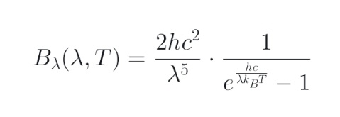

# 太阳能电池物理原理及其效率提升策略分析

## 摘要

本文深入探讨了太阳能电池的物理原理及其效率提升的关键策略。基于Jenny Nelson所著的《The Physics of Solar Cells》及扩展知识体系，从半导体出发，详细阐述了光电导效应与光伏效应的基本原理。文章进一步分析了半导体的能级分裂、能带结构及其作为太阳能电池核心材料的原因，同时介绍了内建电场、载流子运动及二极管特性。在结构部分，描述了接触电极、钝化层、旁路二极管、阻塞二极管、控制器及逆变器的功能。此外，探讨了黑体辐射、普朗克定律、维恩位移定律等重要模型，并解析了效率计算的关键概念。最后，针对中国太阳能电池产业面临的外部围堵与内部挑战，提出了强化原创与标准制定、转向"价值战"及保障供应链安全等突破口。

**关键词：** 太阳能电池；半导体物理；光电导效应；光伏效应；内建电场；载流子；二极管特性；效率提升策略；黑体辐射

---

## 1 引言

基于Jenny Nelson所著的权威著作《The Physics of Solar Cells》，本文从宏观到微观系统梳理太阳能电池的工作原理，包括半导体的能级结构、内建电场的形成机制、载流子的产生与输运过程，以及二极管特性在太阳能电池中的应用。

---

## 2 太阳能电池的核心原理

### 2.1 太阳能电池发电的本质

太阳能电池的核心结构是**半导体**，其本质是一个巨大的**二极管**。

- 光具有波粒二象性：信息传递对应波动性，能量传递对应粒子性
- 一个光子被半导体吸收后产生一个电子和一个空穴，统称**载流子**
- 电子和空穴的数量决定**电流**，电势差决定**电压**
- **光电导效应**：材料受光照后电阻降低，导电性增强
- **光伏效应**：材料受光照后自身产生电压

### 2.2 半导体

#### 2.2.1 定义
导电能力介于导体和绝缘体之间的材料，导电性可被精确控制和改变。

#### 2.2.2 能级分裂
当2个相同原子结合成分子，2个原子能级形成2个分子能级——一个略低，一个略高。这就是**能级分裂**。

#### 2.2.3 能带
当很多原子结合时，每个原子能级分裂成很多分子能级，一系列接近的能级形成**能带**。

- **金属**：不同能带重合
- **半导体和绝缘体**：各能带分开，之间形成**带隙**
- **价带**：有电子占据的最高能带
- **导带**：没有电子占据的最低能带

#### 2.2.4 为什么太阳能电池的核心结构是半导体？

| 材料 | 价带 | 导带-价带 | 结果 |
|------|------|-----------|------|
| 金属 | 部分充满 | 无带隙 | 价电子易跃迁，导热导电好 |
| 半导体 | 充满 | 有较宽带隙 | 需吸收能量→导电，光→电转换 |
| 绝缘体 | 充满 | 有很宽带隙 | 难以导电 |

半导体是将光能转化为电能的绝佳材料。

#### 2.2.5 内建电场

在半导体内部，由于电荷非均匀分布（或不同材料接触）而自发形成的、稳定的静电势场。**不需要外部电压维持。**

常见内建电场结构：
- **PN结**
- **肖特基结**
- **异质结**

> 核心作用：分离光生载流子，实现电荷积累和电压输出。这是光伏效应的**先决条件**。



### 2.3 载流子

导带电子和价带空穴的运动运载了电流 **J**（电流密度），合称载流子。

- 太阳能电池内部本就有一部分载流子（用于形成内建电场）
- 太阳光的作用：让价电子更多地从价带跃迁到导带，形成更多电子和空穴

### 2.4 二极管

具有单向导电特性的半导体电子器件。只允许电流从正向通过，几乎阻断反向电流。任何能形成稳定、非对称势垒（即内建电场）的半导体结构，原则上都能制造出二极管。


---

## 3 太阳能电池的基本结构

### 3.1 接触电极
制作在太阳能电池正面和背面，用于收集光生电流并将其导出至外部电路的金属（或高导电）结构。

### 3.2 钝化层

#### 3.2.1 作用
"安抚"和"保护"硅片表面那些极其活跃、会无情吞噬光生载流子的缺陷态，从而大幅提升电池的电压和效率。

#### 3.2.2 为什么需要钝化层？
- 硅晶体切割后，表面晶体周期性被打断，存在大量**悬挂键**（未饱和化学键）
- 悬挂键在禁带中引入高密度界面缺陷态
- 缺陷态产生严重的**表面复合**：电子和空穴在缺陷态中复合并将能量以发热形式耗散
- 钝化层通过**化学钝化**或**场效应钝化**（或两者协同），使载流子不再进入缺陷态

### 3.3 旁路二极管

#### 3.3.1 位置
集成在太阳能组件的接线盒内，一般每18-24片电池串联并联一个旁路二极管。

#### 3.3.2 热斑效应
当组件中部分电池被遮挡（阴影、灰尘、鸟粪、积雪）或损坏时：
- 被遮挡电池无法产生电流，电阻升高
- 串联电路中其他正常电池的电流必须强行通过它
- 该电池从"发电机"变为"耗电器"，消耗功率并急剧发热 → **热斑效应**
- ⚠️ 长期高温可永久破坏电池片甚至烧穿背板，引发火灾

#### 3.3.3 作用
当某串电池出现反向电压（热斑）时，旁路二极管从截止变为正向导通，为电流提供低电阻旁路通道，绕过故障电池串。

### 3.4 阻塞二极管

#### 3.4.1 位置
安装在太阳能电池方阵的输出端与负载或蓄电池之间，串联在主回路中。

#### 3.4.2 为什么需要？
夜间或阴雨天，电池板电压为零或很低，蓄电池电压较高。若无阻塞二极管，蓄电池电流会反向流回电池板，导致能量浪费和设备损害。

#### 3.4.3 作用
单向阀门——只允许电流从电池板流向蓄电池/负载，严格阻止反向电流。

### 3.5 控制器
管理蓄电池在不同时段的充放电，使得太阳能最大化利用。

### 3.6 逆变器
将直流转换为交流。

---

## 4 太阳能电池物理中的重要模型和定理

### 4.1 黑体

**定义：** 一种理想物理模型，其发出的辐射仅与本身温度T有关。

**在光伏中的三个"基准"作用：**
1. **光谱的基准**：定义太阳光的标准形态
2. **效率的基准**：划定能量转换的终极理论边界
3. **复合的基准**：标定最理想的载流子复合机制

### 4.2 普朗克黑体辐射定律
描述黑体辐射光谱的精确形状。对给定温度T，可画出Bλ随λ变化的曲线——黑体辐射谱。

### 4.3 维恩位移定律
通过对普朗克公式求导取极大值得出。辐射峰波长与温度成反比：
- 温度升高 → 峰值向短波移动（蓝移）
- 温度降低 → 峰值向长波移动（红移）

### 4.4 斯特藩-玻尔兹曼定律
将普朗克公式对所有波长积分，得黑体单位面积总辐射功率P ∝ T⁴。

### 4.5 精细平衡原理
在热平衡状态下，任何一个微观物理过程与其逆过程的发生率必须精确相等。在太阳能电池语境下：给定频率下，器件吸收光子的速率 = 发射同能量光子的速率。

### 4.6 量子隧穿效应
微观粒子在总能量低于前方势垒高度时，仍有一定概率穿越势垒出现在另一侧。

---

## 5 计算太阳能电池效率的关键概念

| 概念 | 定义 |
|------|------|
| **光子角通量 (β)** | 单位时间、单位面积、单位立体角、单位波长间隔内，从特定方向入射的光子数 |
| **光子通量 (b)** | βcosθ在可接受辐射的立体角范围内的积分 |
| **光谱辐照度** | 光子通量b × 单色光子能量E的积分 |
| **总辐照度** | 光谱辐照度对所有波长的积分 |
| **辐照光谱** | 太阳辐射能量通量密度随波长的分布函数 |
| **量子效率 (QE)** | 外量子效率 = 被收集的光生载流子数 / 入射光子总数 |
| **光生电流 Jph** | Σ(太阳光子通量 × QE) 对所有波长的卷积 |
| **暗电流 Jd** | 电池内部为产生内建电场而存在的微小电流，上限为反向饱和电流 |
| **击穿电压** | 反向偏压增大导致电流急剧增加时的临界电压 |
| **寄生电阻** | 非理想、非故意的固有电阻（体电阻、背板金属层电阻、边缘漏电等） |
| **理想因子 (n)** | 定量描述实际J-V特性与理想二极管方程的偏离程度 |
| **填充因子 (FF)** | FF × Jsc × Voc = η（转化效率） |

> **优化方向：** 最小化Rs（串联电阻），最大化Rsh（并联电阻）

---

## 6 肖克利-奎瑟极限（Shockley-Queisser Limit）

### 6.1 定义
在理想条件下，单结太阳能电池所能达到的理论最高光电转换效率。

### 6.2 计算假设
1. 单一带隙材料
2. 完美晶体（无缺陷，无杂质），唯一复合机制为辐射复合
3. 每个光子产生一个电子-空穴对（多余能量热化损失）
4. 理想光学特性（>Eg吸收率100%，<Eg吸收率0%）
5. 标准AM1.5G太阳光谱
6. 电池温度300K

### 6.3 三大固有能量损失机制

```
1. 子带隙光子损失：hν < Eg → 无法激发电子
2. 热化损失：    hν > Eg → 多余能量以声子形式耗散
3. 辐射复合损失： 电池自身发射光子（暗电流）抵消部分光生电流
```

### 6.4 突破SQ极限的路径
- **叠层/多结电池**：多个不同带隙材料分层吸收
- **中间带/杂质带电池**：利用两个子带隙光子激发一个电子
- **热载流子电池**：在热电子冷却前收集
- **量子点/上转换/下转换**：改变入射光子能量匹配带隙
- **聚光光伏**：透镜反射镜聚光，提高光强→提升电压

---

## 7 中国太阳能电池的外部围堵和内部挑战

### 7.1 现状
中国整体已摆脱传统技术"卡脖子"困境，但面临新型"软性"挑战："外部围堵"取代"卡脖子"，"内卷"和"大而不强"成为新瓶颈。

### 7.2 外部挑战：知识产权围堵与标准话语权争夺

| 问题 | 应对 |
|------|------|
| 海外企业利用"僵尸专利""休眠专利"发起诉讼 | 国家专项政策，计划2027年培育高价值专利+海外维权 |
| 国际标准制定受制于人（如碳足迹核算） | 企业发展异质结等新路线，绕过专利壁垒，构建自主专利池 |

### 7.3 内部隐患：产业"内卷"与质量风险

| 问题 | 应对 |
|------|------|
| 2024年主要光伏企业合计亏损超286亿元 | "整治内卷式竞争"写入2025年政府工作报告 |
| 2025上半年组件抽检不合格率逼近16%（功率虚标、材料劣质） | 建立以转化效率为核心的动态标准，市场准入淘汰落后产能 |

### 7.4 未来关键突破口
1. **强化原创与标准制定**：持续投入钙钛矿、叠层电池等前沿技术，推动中国标准国际化
2. **从"价格战"转向"价值战"**：下游电站建立严苛组件评价体系，倒逼质量提升
3. **保障供应链安全**：中国已对碲、铟等关键材料实施出口管制

---

## 8 对于材料专业的认识、学习和构想

### 8.1 认识
材料专业几乎与所有工业领域息息相关——航空航天、房产建设、金属、半导体、有机材料。材料决定着各个领域的上限，新装备研发往往取决于材料突破。

### 8.2 学习
本学期学习了荧光和太阳能物理方面的知识。发现只要想学，可以很快了解一门学科的大致框架（本文的太阳能知识用了3个晚上自己看书整理）。

### 8.3 构想
- 高中时就立志为国家做出巨大贡献，材料是最适合大展身手的学科
- 规划：读硕 → 读博 → 成为四青人才
- 短期：寒假加入实验室项目，积累科研经验

---

> **参考书目：** Jenny Nelson, *The Physics of Solar Cells*
